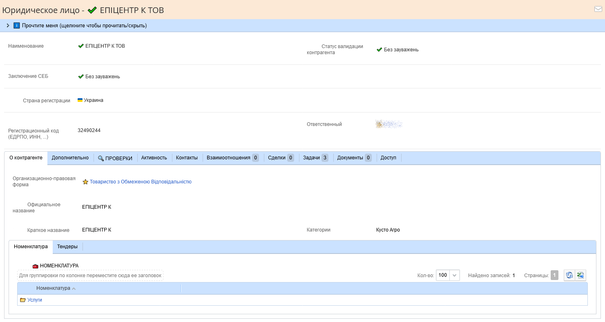
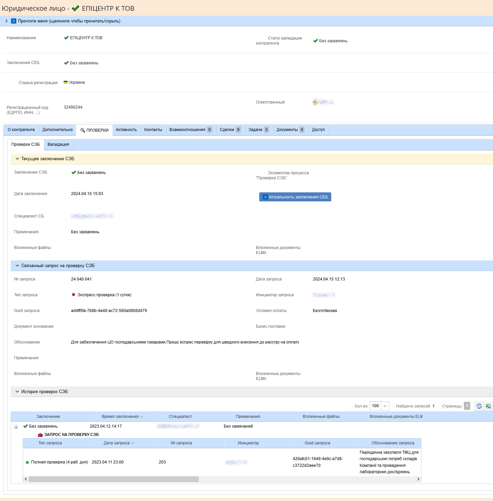
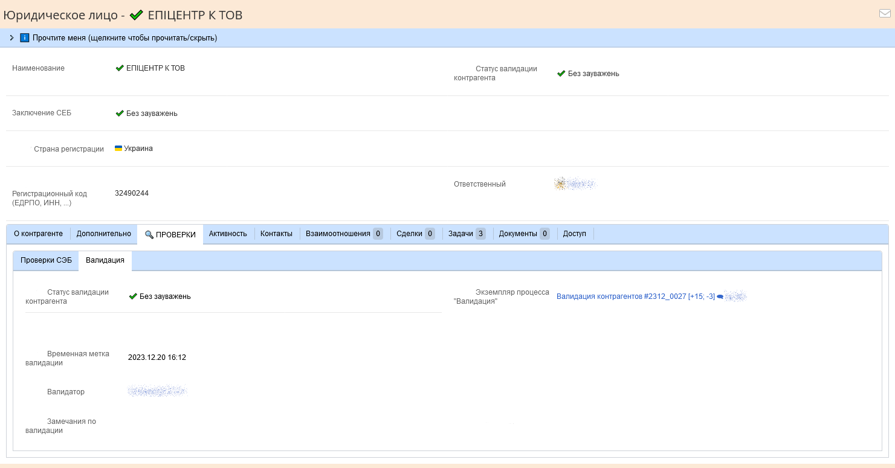

[🏠 Головна](../README.MD) / [📘 Довідники](./README.MD)  

# 📘 Контрагент `Contractor`

## Структура довідника

| Пошук | Властивість   `Property` | Тип даних   `Data type` | Примітки |
| --- | --- | --- | --- |
| ✔️ | Організаційно-правова форма   `LegalForm` | [📘 Організаційно-правова форма](./LegalForm.md)   `LegalForm` |  |
| ✔️ | Коротка назва   `ShortName` | Стрічка   `String` |  |
| ✔️ | Офіційна назва   `OfficialName` | Стрічка   `String` |  |
| ✔️ | Країна реєстрації контрагента   `RegistrationCountry` | [🎲 Країна реєстрації контрагента](../Enums/EContractorRegistrationCountry.md)   `Type` |  |
| ✔️ | Реєстраційний код (ЄДРПО, ІНН, ...)   `RegCode` | Стрічка   `String` | Має бути унікальним для резидентів та коректним по контрольній сумі |
| ✔️ | Відповідальний   `ResponsibleUser` | [📘 Користувач](./User.md)   `User` |  |
| ✔️ | Спеціальний контрагент   `SpecialContractor` | [🎲 Спеціальний контрагент](../Enums/ESpecialContractor.md)❓   `ESpecialContractor❓` |  |
|  | 📦 НОМЕНКЛАТУРА   `BL_Nmc` | 📦 Номенклатура   `Contractor__BL_Nmc` |  |
|  | Процес "Перевірка СЕБ"   `WorkflowInstance_SES_Check` | [📘 Екземпляр робочого процесу](./WorkflowInstance.md)   `WorkflowInstance` | Посилання на процес перевірки СЕБ. Якщо процес в активному стані не дозволяти ще один екземпляр |
|  | Спеціаліст СЕБ   `SES_Spec` | [📘 Користувач](./User.md)   `User` |  |
| ✔️ | Заключення СЕБ   `SES_Conclusion` | [🎲 Статус СЕБ](../Enums/EStatusOfSES.md)   `EStatusOfSES` | Результат перевірки контрагента спеціалістом СЕБ (служби економічної безпеки). Далі система може використовувати в (різних місцях) фільтр тільки по контрагентам, що пройшли перевірку |
| ✔️ | Час надання заключення СЕБ   `SES_ConclusionTime` | Дата / час   `DateTime` |  |
|  | Примітки до заключення СЕБ   `SES_ConclusionRem` | Стрічка   `String` |  |
|  | Процес "Валідація контрагента"   `WorkflowInstance_Validation` | [📘 Екземпляр робочого процесу](./WorkflowInstance.md)   `WorkflowInstance` | Посилання на процес валідації контрагента. Якщо процес в активному стані не дозволяти ще один екземпляр |
|  | Спеціаліст по валідації   `Validation_Spec` | [📘 Користувач](./User.md)   `User` |  |
| ✔️ | Заключення валідації   `Validation_Conclusion` | [🎲 Статус валідації контрагента](../Enums/EContractorValidationStatus.md)   `EContractorValidationStatus` | Результат валідації контрагента - перевірки інформації про котрагента, та відсутності дублювання. Далі система може використовувати в (різних місцях) фільтр тільки по контрагентам, що пройшли перевірку |
| ✔️ | Час надання заключення валідації   `Validation_ConclusionTime` | Дата / час   `DateTime` |  |
|  | Примітки до заключення валідації   `SES_ConclusionRem` | Стрічка   `String` |  |
|  | Цей контрагент дублює   `ThisContractorIsDuplicateOf` | [📘 Контрагент](./Contractor.md)   `Contractor` | Посилання на контрагента якого дублює цей. Не дозволяти посилання на себе |

### Структура блоку 📦 Номенклатура `Contractor__BL_Nmc`

| Властивість   `Property` | Тип даних   `Data type` | Примітки |
|---|---|---|
| Номенклатура   `Nmc` | [📘 Номенклатура](./Nomenclature.md)   `Nomenclature` | |

Об'єкт контрагента включає в себе значно більше інформації (що було дороблено в системі ЕЛМА), наприклад додаткову інформацію про перевірку СЕБ, історію перевірок СЕБ, додаткову інформацію про валідацію контрагента, тощо.
Проте для лаконічності ця інформація тут відображена у вигляді скріншотів форми контрагента, і за необхідності може бути надана в розгорнутому вигляді.

Основна інформація про контрагента

Інформація про заключення СЕБ

Інформація про валідацію контрагента

