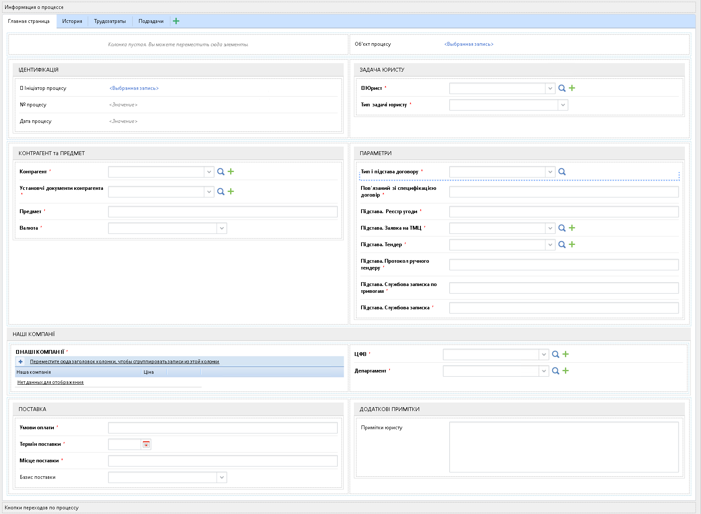

[🏠 Головна](../../../README.MD) / [⚙️ Бізнес-процеси](../../README.MD) / `16` ⚙️ Задача юристу

# `Процес #16` ⚙️ Задача юристу

Це приблизний опис процесу, виключно для його розуміння

## Короткий опис процесу

Процесс призначено для надання юристу інформації про договір, що необхідно запустити на погодження, замісь того щоб повідомляти юристу відповідну інформацію по телефону, email, месенджером, тощо.
Ініціатор цього процесу заповнює форму з ключовою інформацією про договір та відправляє на подальше опрацювання, після цього дані ініціатора копіюються в спеціальний об'єкт [`📘 Задача юристу`](../../../Entities/TaskToLawyer.md) запускається процес погодження договору в який під час запуску передається об'єкт в нього копіюється надана ініціатором інформація, батьківський процес заваршує своє виконання

## Діаграма процесу

**Діаграма процесу**  

## Контекст процесу

|🛠️| Властивість   `Property` | Тип даних   `DataType` | Примітки |
|---|---|---|---|
|| Назва процесу   `ProcName` | Стрічка   `String` |  |
|| Статус процесу   `ProcStatus` | 🎲 [Статус задачі юристу](../../../Enums/ETaskToLawyerStatus.md)   `ETaskToLawyerStatus` |  |
|| № процесу   `ProcNumber` | Ціле число   `Int64` |  |
|| Дата процесу   `ProcDate` | Дата / час   `DateTime` |  |
|| 👤 Ініціатор процесу   `Z10Usr_Initiator` | 📘 [Користувач](../../../Entities/User.md)   `User` |  |
|| 👤 Юрист   `Usr_Lawyer` | 📘 [Користувач](../../../Entities/User.md)   `User` |  |
|| Тип задачі юристу   `TaskToLawyerType` | 🎲 [Тип задачі юристу](../../../Enums/ETaskToLawyerType.md)   `ETaskToLawyerType` |  |
|| ЦФВ   `CFR` | 📘 [ЦФВ (Центр Фінансової Відповідальності)](../../../Entities/CFR.md)   `CFR` |  |
|| Департамент   `Department` | 📘 [Департамент](../../../Entities/Department.md)   `Department` |  |
|| Контрагент   `Contractor` | 📘 [Контрагент](../../../Entities/Contractor.md)   `Contractor` |  |
|| Установчі документи контрагента   `ContractorFoundationDocs` | 🗃 Колекція<📘 [Вкладення](../../../Entities/Attachment.md)>   `ICollection<Attachment>` |  |
|| Тип договору   `ContractType` | 🎲 [Тип договору](../../../Enums/EContractType.md)   `EContractType` |  |
|| Шаблон договору   `ContractTemplateType` | 🎲 [Тип шаблону договору](../../../Enums/EContractTemplateType.md)   `EContractTemplateType` |  |
|| Пов'язаний зі специфікацією договір   `SpecificationRelatedContract` | 📕 [Договір](../../../Documents/D24032_Contract.md)   `D24032_Contract` |  |
|| Тип підстави   `BasementType` | 🎲 [Тип підстави договору](../../../Enums/EContractBasementType.md)   `EContractBasementType` |  |
|| Підстава. Реєстр угоди   `Base_DealRegister` | 📕 [Реєстр угоди](../../../Documents/KD_DealRegister.md)   `KD_DealRegister` |  |
|| Підстава. Заявка на ТМЦ   `Base_AppForTMC` | 📘 [Заявка на ТМЦ](../../../Entities/Request.md)   `Request` |  |
|| Підстава. Тендер   `Base_Tender` | 📘 [Тендер](../../../Entities/Tender.md)   `Tender` |  |
|| Підстава. Протокол ручного тендеру   `Base_TenderManual` | 📕 [Протокол ручного тендеру](../../../Documents/D24032_ManualTender.md)   `D24032_ManualTender` |  |
|| Підстава. Службова записка по тривогам   `Base_ServiceNoteByAllerts` | 📕 [Службова записка по тривогам](../../../Documents/AppTMCv2Doc_UrgentByAlert.md)   `AppTMCv2Doc_UrgentByAlert` |  |
|| Предмет   `Subject` | Стрічка   `String` |  |
|| Ціна   `Price` | Дробне число   `Double` |  |
|| Валюта   `Currency` | 🎲 [Валюта](../../../Enums/ECurrency.md)   `ECurrency` |  |
|| Умови оплати   `PaymentConditions` | Стрічка   `String` |  |
|| Термін поставки   `DeliveryTime` | Дата / час   `DateTime` |  |
|| Місце поставки   `DeliveryPlace` | Стрічка   `String` |  |
|| Базис поставки   `DeliveryBasis` | 🎲 [Базис поставки](../../../Enums/EDeliveryBasis.md)   `EDeliveryBasis` |  |
|| Примітки юристу   `RemarksForLawyer` | Стрічка   `String` |  |
|| Об'єкт процесу   `ProcObject` | 📘 [Задача юристу](../../../Entities/TaskToLawyer.md)   `TaskToLawyer` |  |
|| 🧰 НАШІ КОМПАНІЇ   `BL10_OurCompanies` | 🚧   `🚧` |  |
|| ░ Наша компанія   `BI_OurCompany` | 📘 [Наша компанія](../../../Entities/OurCompany.md)   `OurCompany` |  |
|| ░ Кількість   `BI_Amount` | Дробне число   `Double` |  |
|| ░ Сума   `BI_Sum` | Дробне число   `Double` |  |

# Задачі процесу
## Z10T10 - Підготовка даних

### Дані на формі

Опис колонки **На формі**:
- `🚫      ` — Приховано
- `  👁️    ` — Тільки для перегляду
- `     ✏️ ` — Для заповнення
- `     ✏️❗` — Для заповнення, **обов'язково**

|🛠️| Властивість   `Property` | Тип даних   `DataType` | Примітки |
|---|---|---|---|
|| Назва процесу   `ProcName` | Стрічка   `String` | False |
|| Статус процесу   `ProcStatus` | 🎲 [Статус задачі юристу](../../../Enums/ETaskToLawyerStatus.md)   `ETaskToLawyerStatus` | False |
|| Об'єкт процесу   `ProcObject` | 📘 [Задача юристу](../../../Entities/TaskToLawyer.md)   `TaskToLawyer` | False |
|| 👤 Ініціатор процесу   `Z10Usr_Initiator` | 📘 [Користувач](../../../Entities/User.md)   `User` | False |
|| № процесу   `ProcNumber` | Ціле число   `Int64` | False |
|| Дата процесу   `ProcDate` | Дата / час   `DateTime` | False |
|| 👤 Юрист   `Usr_Lawyer` | 📘 [Користувач](../../../Entities/User.md)   `User` | False |
|| Тип задачі юристу   `TaskToLawyerType` | 🎲 [Тип задачі юристу](../../../Enums/ETaskToLawyerType.md)   `ETaskToLawyerType` | False |
|| Контрагент   `Contractor` | 📘 [Контрагент](../../../Entities/Contractor.md)   `Contractor` | False |
|| Установчі документи контрагента   `ContractorFoundationDocs` | 🗃 Колекція<📘 [Вкладення](../../../Entities/Attachment.md)>   `ICollection<Attachment>` | False |
|| Предмет   `Subject` | Стрічка   `String` | False |
|| Валюта   `Currency` | 🎲 [Валюта](../../../Enums/ECurrency.md)   `ECurrency` | False |
|🚧| Тип і підстава договору   `ContractKindAndBasement` | 📘 [Тип і підстава договору](../../../Entities/ContractKindAndBasement.md)   `ContractKindAndBasement` | False |
|| Пов'язаний зі специфікацією договір   `SpecificationRelatedContract` | 📕 [Договір](../../../Documents/D24032_Contract.md)   `D24032_Contract` | False |
|| Підстава. Реєстр угоди   `Base_DealRegister` | 📕 [Реєстр угоди](../../../Documents/KD_DealRegister.md)   `KD_DealRegister` | False |
|| Підстава. Заявка на ТМЦ   `Base_AppForTMC` | 📘 [Заявка на ТМЦ](../../../Entities/Request.md)   `Request` | False |
|| Підстава. Тендер   `Base_Tender` | 📘 [Тендер](../../../Entities/Tender.md)   `Tender` | False |
|| Підстава. Протокол ручного тендеру   `Base_TenderManual` | 📕 [Протокол ручного тендеру](../../../Documents/D24032_ManualTender.md)   `D24032_ManualTender` | False |
|| Підстава. Службова записка по тривогам   `Base_ServiceNoteByAllerts` | 📕 [Службова записка по тривогам](../../../Documents/AppTMCv2Doc_UrgentByAlert.md)   `AppTMCv2Doc_UrgentByAlert` | False |
|🚧| Підстава. Службова записка   `Base_ServiceNote` | 📕 [Службова записка](../../../Documents/ServiceNote.md)   `ServiceNote` | False |
|🚧| 🧰 НАШІ КОМПАНІЇ   `BL10_OurCompanies` | 🚧   `🚧` | False |
||    Наша компанія   `BI_OurCompany` | 📘 [Наша компанія](../../../Entities/OurCompany.md)   `OurCompany` | False |
||    Ціна   `BI_Price` | Дробне число   `Double` | False |
|| ЦФВ   `CFR` | 📘 [ЦФВ (Центр Фінансової Відповідальності)](../../../Entities/CFR.md)   `CFR` | False |
|| Департамент   `Department` | 📘 [Департамент](../../../Entities/Department.md)   `Department` | False |
|| Умови оплати   `PaymentConditions` | Стрічка   `String` | False |
|| Термін поставки   `DeliveryTime` | Дата / час   `DateTime` | False |
|| Місце поставки   `DeliveryPlace` | Стрічка   `String` | False |
|| Базис поставки   `DeliveryBasis` | 🎲 [Базис поставки](../../../Enums/EDeliveryBasis.md)   `EDeliveryBasis` | False |
|| Примітки юристу   `RemarksForLawyer` | Стрічка   `String` | False |