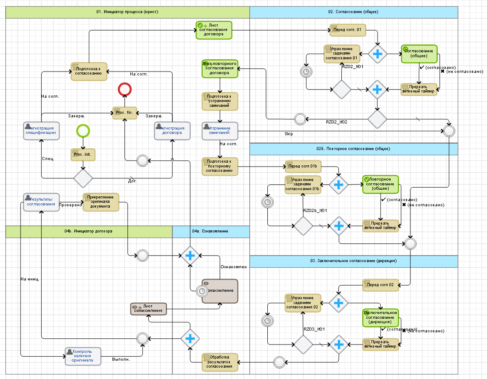

[🏠 Головна](../../../README.MD) / [⚙️ Бізнес-процеси](../../README.MD) / ⚙️ Погодження договору

# `🚧 Процес #17` ⚙️ Погодження договору

## Короткий опис процесу

Процес призначений для погодження договорів та специфікацій. Він може бути використаний для одночасного погодження пачки договорів (між вказаним котрагентом та декількома нашими компаніями). 

Після завершення процесу тільки погоджені договори (та/або специфікації) можуть бути обрані для використання; не погодженні користувач обрати не може (в інших процесах).

Даному процесу передує процес [`⚙️ Задача юристу`](../16/README.MD) в якому продукується об'єкт [`📘 Задача юристу`](../../../Entities/TaskToLawyer.md), що містить інформацію про договір (та / або специфікацію) що потрібно запустити на погодження, цей об'єкт необхідно обв'язково вказати при старті процесу, або ж процес автоматично запуститься після процесу [⚙️ Задача юристу](../16/README.MD).

## Вимоги до процесу

- [ ] Після запуску процесу в контекст процесу копіюється інформація з об'єкту [📘 Задача юристу](../../../Entities/TaskToLawyer.md) та далі відображається на формі у юриста `Z10T10`. Більшість скопійованих значень доступні для редагування, інформація яку надав ініціатор - ні.

- [ ] Після запуску процесу в контекст процесу завантажується `📘 Об'єкт конфігурації процесу`, з якого вході перебігу процесу будуть читатись різноманітні його налаштування.

- [ ] Якщо було вказано декілька наших компаній - далі буде запущено декілька підпроцесів безпосереднього погодження (у  зоні `Z20`).

- [ ] Юрист може запустити на погодження договір, специфікацію, та одночасно і договір і специфікацію (в залежності від того як вказав ініціатор), але не може обирати сам.

- [ ] В залежності від того що саме запускає юрист (договір та/або специфікацію) на формі його задачі з'являються або приховуються, стають опціональними або необхідними для заповнення відповідні поля.

- [ ] Після того як юрист вніс всю необхідну інформцію і натиснув кнопку запуску погодження перед ним постає модальне діалогове вікно в якому він може переглянути перелік учасників погодження (та у випадку необхідності звернутись до адміністратора для їх коригування). Учасники погодження читаються із `📘 Об'єкт конфігурації процесу` та/або об'єкту `📘 Тип і підстава договору`

- [ ] Після завершення роботи юристом запускаються підпроцеси (у випадку декількох наших компаній) або підпроцес (якщо одна) в яких відбувається безпосереднє погодження договору/специфікації.

- [ ] У випадку негативного рішення погодження процес повертається на коригування юристу. Юрист може відправити договір/специфікацію на повне перепогодження, або ж тільки тим учасникам, що не погодили, рішення що обрати він приймає сам.

- [ ] На формі коригування юрист може внести:
	- Примітки
	- Вкладення
	- Вкладення з документами
	- Оновити версію договору та/або специфікації
	- Додати нового учасника погодження

- [ ] Результат погодження договору: якщо всі погодили - погоджено, інакше - ні.

- [ ] Переривання погодження договору по таймеру і його автопогодження — функціонал не потрібен.

- [ ] 

## Діаграма процесу
Застаріла діаграма процесу  
