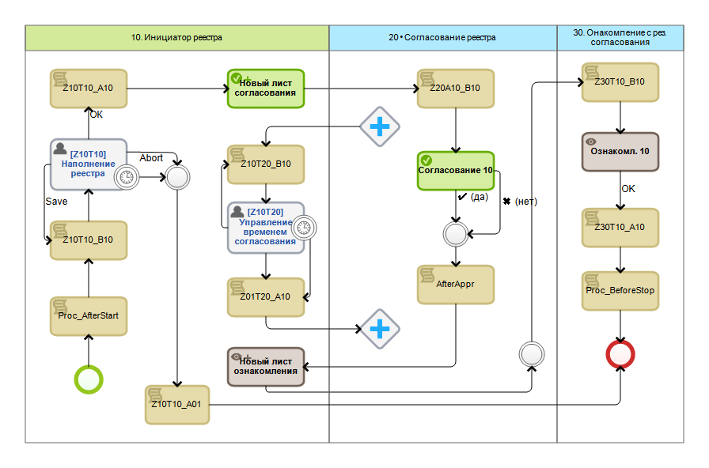

[🏠 Головна](../../../README.MD) / [⚙️ Бізнес-процеси](../../README.MD) 

# `24` ⚙️ Реестр сделки ([📥 автодокументація](./AutoDoc/))

Процес призначений для створення і погодження документу реєстру угоди, що пізніше буде використовуватись як підстава до договору продажам.

**Діаграма процесу**  

Після запуску процесу, його ініціатору відображається форма призначена для наповнення реєстру `Z10T10`:  
