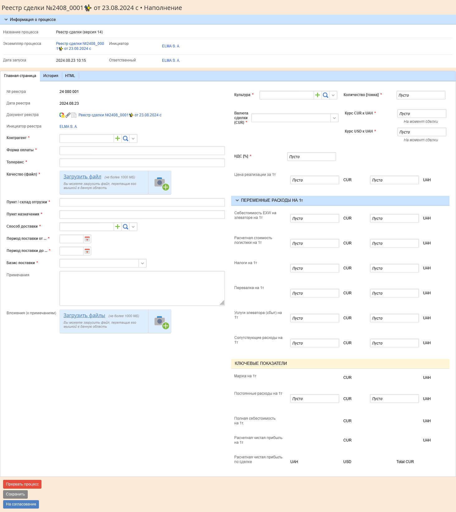
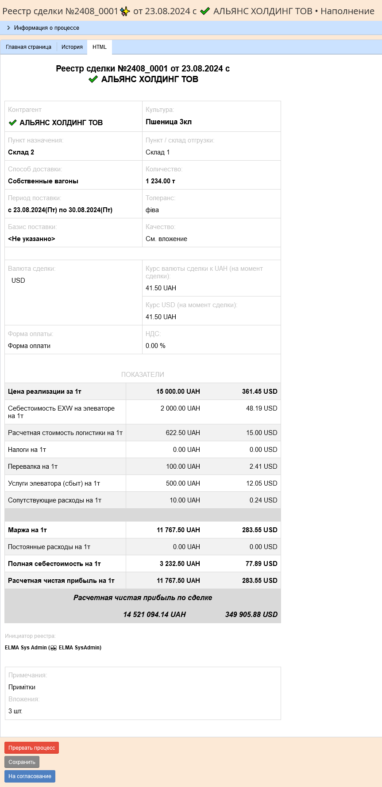
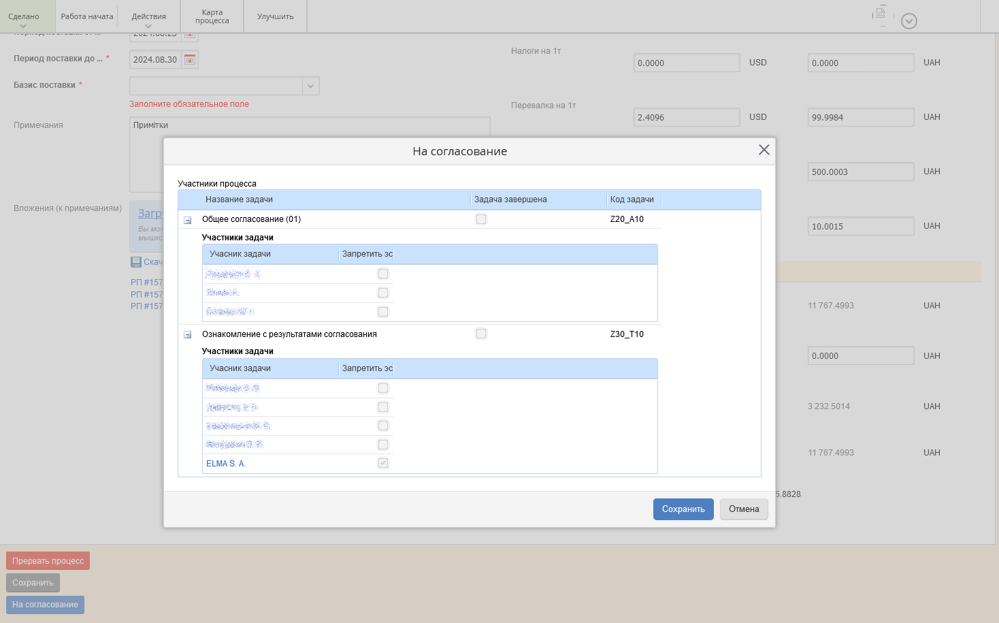

[🏠 Головна](../../../README.MD) / [⚙️ Бізнес-процеси](../../README.MD) 

# `24` ⚙️ Реестр сделки

## Матеріали для скачування

- [📥 Автодокументація по процесу](./ForDownload/AutoDoc/)
- [📥 Шаблон для генерації документу процесу](./ForDownload/DocTemplate/)
- [📥 Шаблон для генерації HTML відображення даних процесу](./ForDownload/HtmlFormTemplate/)

## Короткий опис процесу

Процес призначений для створення і погодження документу `Реєстр угоди`, що пізніше буде використовуватись як підстава до договору продажам.

---

В процесі, після його запуску, використовується форма наповнення (для ініціатора процесу) в якій він задає всю необхідну інформацію, а далі форма узгодження на якій учасники погодження можуть переглянути задану ініціатором інформацію у вигляді HTML-розмітки або ж у вигляді документа.
Таким чином в процесі використовується (відносно складна) форма наповнення реєстру, HTML-відображення даних реєстру, електронний документ реєстру з друкованою формою, що генерується під час перебігу процесу.

## Діаграма процесу

## Форма `[Z10T10] Наполнение реестра`
Після запуску процесу, його ініціатору відображається форма призначена для наповнення реєстру `[Z10T10] Наполнение реестра`.

### Форма `[Z10T10] Наполнение реестра` / Вкладка `Головна сторінка`

### Форма `[Z10T10] Наполнение реестра` / Вкладка `HTML`

**Вхідні переходи**:  
- `Z10T10_B10` — Процес прямує до одноіменного скрипту (див. діаграму процесу), де відбувається регенерація документу процесу, та HTML-форми для наглядного відображення даних процесу.

**При завантаженні форми виконується сценарій**:  
- `Z10T10_OnFormLoad(Context context, FormViewBuilder form)` - в якому відбуваєтсья переналаштування видимості, обов'язковості до заповнення та обрахунок полів, що входять до складу цієї форми.

**Вихідні переходи**:  
- `ОК` - При натисканні кнопки `На согласование` — Відображується спливаюча форма `Z10T10_A10__OK` з відображенням подальших учасників процесу (діалогове вікно по відношенню до основної форми). Після натискання кнопки `Сохранить` на цій формі, вона зникає, перевіряється заповнення всіх обов'язкових полей та процес переходить до наступного свого кроку (див. діаграму процесу)
- `Save` — При натисканні кнопки `Сохранить` — Процес переходить до наступного свого кроку (див. діаграму процесу), де відбувається регенерація документу процесу, та HTML-форми для наглядного відображення даних процесу. Перевірка обов'язковості заповнення даних не відбувається.
- `Abort`  — При натисканні кнопки `Прервать процесс` —  Відображується повідомлення чи користувач дійсно бажає перервати процес, після позитивної відповіді - процес прямує шляхом свого завершення. Перевірка обов'язковості заповнення даних не відбувається.
- `Автоматична ескалація` - По завершенню відведеного часу - процес прямує шляхом свого завершення (тобто аналогічно попередньому переходу тільки по сплинанню певного часу).

### Опис полів форми Z10T10

Опис колонки **На формі**:
- `🚫      ` — Приховано
- `  👁️    ` — Тільки для перегляду
- `     ✏️ ` — Для заповнення
- `     ✏️❗` — Для заповнення, **обов'язково**

| На формі | Назва на формі   `Змінна` | Тип даних   `Тип в коді` | Скрипт | Примітки |
| --- | --- | --- | --- | --- |
| `  👁️    ` | № реестра   `RegNumber` | Ціле   `Int64` |  | Генерується автоматично після запуску процесу у форматі 2405_0001 (рік, місяць, порядковий №) | |
| `  👁️    ` | Дата реестра   `Дата реестра` | Дата / время   `DateTime` |  | Присвоюється після запуску процесу |
| `  👁️    ` | Документ реестра   `RegDocument` | 📕 Реєстр угоди   `KD_DealRegister` |  |  |
| `  👁️    ` | Инициатор реестра   `ProcUsrZ10_RegInitiator` | 📘 Пользователь   `🔴 User` |  |  |
| `     ✏️❗` | Контрагент   `RegContractor` | 📘 Контрагент   `🔴 Contractor` |  |  |
| `     ✏️❗` | Форма оплаты   `PaymentForm` | Строка   `String` |  |  |
| `     ✏️❗` | Толеранс   `Tolerans` | Строка   `String` |  |  |
| `     ✏️❗` | Качество (файл)  `Quality` | 📘 Вложение   `Attachment` |  |  |
| `     ✏️❗` | Пункт / склад отгрузки   `PointOfShipping` | Строка   `String` |  |  |
| `     ✏️❗` | Пункт назначения   `PointOfDestination` | Строка   `String` |  |  |
| `     ✏️❗` | Способ доставки   `DeliveryMethod` | 📘 Способ доставки   `🔴 OBJ` |  |  |
| `     ✏️❗` | Период поставки от ...   `DeliveryDateFrom` | Дата / время   `DateTime` |  |  |
| `     ✏️❗` | Период поставки до ...   `DeliveryDateTill` | Дата / время   `DateTime` |  |  |
| `     ✏️❗` | Базис поставки   `BasisOfDelivery` | 🎲 Базис поставки    `🔴 EDeliveryBasis` |  |  |
| `     ✏️ ` | Примечания   `Rem` | Строка   `String` |  | Багатострічковий текст |
| `     ✏️ ` | Вложения (к примечаниям)   `RemAttachments` | 🗃📘 Вложение   `ICollection<Attachment>` |  | Багатострічковий текст |
| `     ✏️❗` | Культура   `Culture` | 📘 С/Х культура    `🔴 OBJ` |  |  |
| `     ✏️❗` | Количество [тоннa]   `Amount__tonne` | Дробное число❓    `Double❓` | `🔧` Z10T10_OnPrCh____Amount__tonne (Context context, FormViewBuilder form) |  |
| `     ✏️❗` | Валюта сделки (CUR)   `DealCUR` | 🎲 Тип валюты❓    `🔴 ECurrencyType❓` | `🔧` Z10T10_OnPrCh____DealCurrency (Context context, FormViewBuilder form) |  |
| `     ✏️❗` | Курс CUR к UAH   `CURtoUAH` | Дробное число❓    `Double❓` | `🔧` Z10T10_OnPrCh____CURtoUAH (Context context, FormViewBuilder form) |  |
| `     ✏️❗` | Курс USD к UAH   `USDtoUAH` | Дробное число❓    `Double❓` | `🔧` Z10T10_OnPrCh____USDtoUAH (Context context, FormViewBuilder form) |  |
| `     ✏️❗` | НДС [%]   `VAT__percents` | Дробное число❓    `Double❓` | `🔧` 	Z10T10_OnPrCh____VAT__percents (Context context, FormViewBuilder form) |  |
| `  👁️    ` | * CUR_Selected   `CUR_Selected` | Строка   `String` |  |  |
| `  👁️    ` | * CUR_UAH   `CUR_UAH` | Строка   `String` |  |  |
| `     ✏️❗` | Цена реализации за 1т [CUR]   `SellingPricePer1ton__CUR` | Дробное число❓    `Double❓` | `🔧` Z10T10_OnPrCh____SellingPricePer1ton__CUR (Context context, FormViewBuilder form) |  |
| `     ✏️ ` | Цена реализации за 1т [UAH]   `SellingPricePer1ton__UAH` | Дробное число❓    `Double❓` | `🔧` Z10T10_OnPrCh____SellingPricePer1ton__UAH (Context context, FormViewBuilder form) |  |
| `     ✏️❗` | Себестоимость EXW на элеваторе на 1т [CUR]   `CostOfEXWatTheElevator__CUR` | Дробное число❓    `Double❓` | `🔧` Z10T10_OnPrCh____CostOfEXWatTheElevator__CUR (Context context, FormViewBuilder form) |  |
| `     ✏️ ` | Себестоимость EXW на элеваторе на 1т [UAH]   `CostOfEXWatTheElevator__UAH` | Дробное число❓    `Double❓` | `🔧` Z10T10_OnPrCh____CostOfEXWatTheElevator__UAH (Context context, FormViewBuilder form) |  |
| `     ✏️❗` | Расчетная стоимость логистики на 1т [CUR]   `EstimatedCostOfLogistics__CUR` | Дробное число❓    `Double❓` | `🔧` Z10T10_OnPrCh____EstimatedCostOfLogistics__CUR (Context context, FormViewBuilder form) |  |
| `     ✏️ ` | Расчетная стоимость логистики на 1т [UAH]   `EstimatedCostOfLogistics__UAH` | Дробное число❓    `Double❓` | `🔧` Z10T10_OnPrCh____EstimatedCostOfLogistics__UAH (Context context, FormViewBuilder form) |  |
| `     ✏️❗` | Налоги на 1т [CUR]   `TaxPer1t__CUR` | Дробное число❓    `Double❓` | `🔧` Z10T10_OnPrCh____TaxPer1t__CUR (Context context, FormViewBuilder form) |  |
| `     ✏️ ` | Налоги на 1т [UAH]   `TaxPer1t__UAH` | Дробное число❓    `Double❓` | `🔧` Z10T10_OnPrCh____TaxPer1t__UAH (Context context, FormViewBuilder form) |  |
| `     ✏️❗` | Перевалка на 1т [CUR]   `TransshipmentPer1t__CUR` | Дробное число❓    `Double❓` | `🔧` Z10T10_OnPrCh____TransshipmentPer1t__CUR (Context context, FormViewBuilder form) |  |
| `     ✏️ ` | Перевалка на 1т [UAH]   `TransshipmentPer1t__UAH` | Дробное число❓    `Double❓` | `🔧` Z10T10_OnPrCh____TransshipmentPer1t__UAH (Context context, FormViewBuilder form) |  |
| `     ✏️❗` | Услуги элеватора (сбыт) на 1т [CUR]   `ElevatorServicesPer1t__CUR` | Дробное число❓    `Double❓` | `🔧` Z10T10_OnPrCh____ElevatorServicesPer1t__CUR (Context context, FormViewBuilder form) |  |
| `     ✏️ ` | Услуги элеватора (сбыт) на 1т [UAH]   `ElevatorServicesPer1t__UAH` | Дробное число❓    `Double❓` | `🔧` Z10T10_OnPrCh____ElevatorServicesPer1t__UAH (Context context, FormViewBuilder form) |  |
| `     ✏️❗` | Сопутствующие расходы на 1т [CUR]   `AssociatedExpensesPer1t__CUR` | Дробное число❓    `Double❓` | `🔧` Z10T10_OnPrCh____AssociatedExpensesPer1t__CUR (Context context, FormViewBuilder form)	 |  |
| `     ✏️ ` | Сопутствующие расходы на 1т [UAH]   `AssociatedExpensesPer1t__UAH` | Дробное число❓    `Double❓` | `🔧` Z10T10_OnPrCh____AssociatedExpensesPer1t__UAH (Context context, FormViewBuilder form) |  |
| `  👁️    ` | Маржа на 1т [CUR]   `MarginPer1t__CUR` | Дробное число❓    `Double❓` |  |  |
| `  👁️    ` | Маржа на 1т [UAH]   `MarginPer1t__UAH` | Дробное число❓    `Double❓` |  |  |
| `     ✏️ ` | Постоянные расходы на 1т [CUR]   `ConstantCostsPer1t__CUR` | Дробное число❓    `Double❓` | Z10T10_OnPrCh____ConstantCostsPer1t__CUR (Context context, FormViewBuilder form) |  |
| `     ✏️ ` | Постоянные расходы на 1т [UAH]   `ConstantCostsPer1t__UAH` | Дробное число❓    `Double❓` | Z10T10_OnPrCh____ConstantCostsPer1t__UAH (Context context, FormViewBuilder form) |  |
| `  👁️    ` | Полная себестоимость на 1т. [CUR]   `FullCostsPer1t__CUR` | Дробное число❓    `Double❓` |  |  |
| `  👁️    ` | Полная себестоимость на 1т. [UAH]   `FullCostsPer1t__UAH` | Дробное число❓    `Double❓` |  |  |
| `  👁️    ` | Расчетная чистая прибыль на 1т [CUR]   `EstimatedNetProfitPer1t__CUR` | Дробное число❓    `Double❓` |  |  |
| `  👁️    ` | Расчетная чистая прибыль на 1т [UAH]   `EstimatedNetProfitPer1t__UAH` | Дробное число❓    `Double❓` |  |  |
| `  👁️    ` | Расчетная чистая прибыль по сделке [UAH]   `EstimatedNetProfit__UAH` | Дробное число❓    `Double❓` |  |  |
| `  👁️    ` | Расчетная чистая прибыль по сделке [USD]   `EstimatedNetProfit__USD` | Дробное число❓    `Double❓` |  |  |
| `  👁️    ` | Total CUR   `LabelOfTotalCUR` | Строка   `String` |  |  |
| `  👁️    ` | DocAsHtml   `DocAsHtml` | HTML разметка    `HtmlString` |  | Відображається на окремій вкладці задачі користувача |

#### Поведінка при зміні полів форми Z10T10

## Форма `[Z10T10_A10__OK] На согласование`

