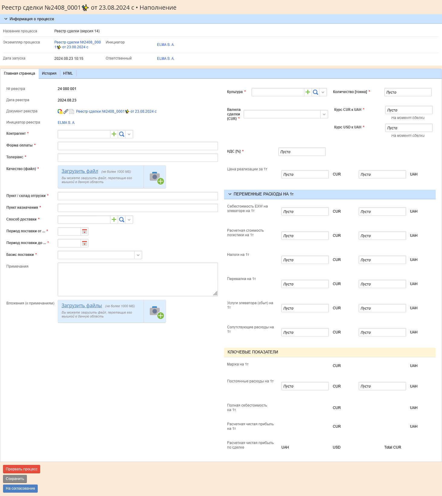

[🏠 Головна](../../../README.MD) / [⚙️ Бізнес-процеси](../../README.MD) 

# `24` ⚙️ Реестр сделки ([📥 автодокументація](./AutoDoc/))

Процес призначений для створення і погодження документу реєстру угоди, що пізніше буде використовуватись як підстава до договору продажам.

**Діаграма процесу**  

Після запуску процесу, його ініціатору відображається форма призначена для наповнення реєстру `[Z10T10] Наполнение реестра`:  

## **Опис полів форми:**

**Опис колонок**:
- 🚫 — Приховано
- 🔍 — Тільки для читання
- ✏️ — Може редагуватись, 
- ⚠️ — Обов'язково для заповнення
- 🔧 — При зміні значення виконується скрипт

| Назва на формі   `Змінна` | Тип даних   `Тип даних в коді` | 🚫 | 🔍 | ✏️⚠️ | 🔧 | Скрипт | Примітки |
| --- | --- | :---: | :---: | :---: | :---: | --- | --- |
| № реестра   `RegNumber` | Ціле   `Int64` |  | 🔍 |  |  |  | Генерується автоматично після запуску процесу у форматі 2405_0001 (рік, місяць, порядковий №) | |
| Дата реестра   `Дата реестра` | Дата / время   `DateTime` |  | 🔍 |  |  |  | Присвоюється після запуску процесу |

---
