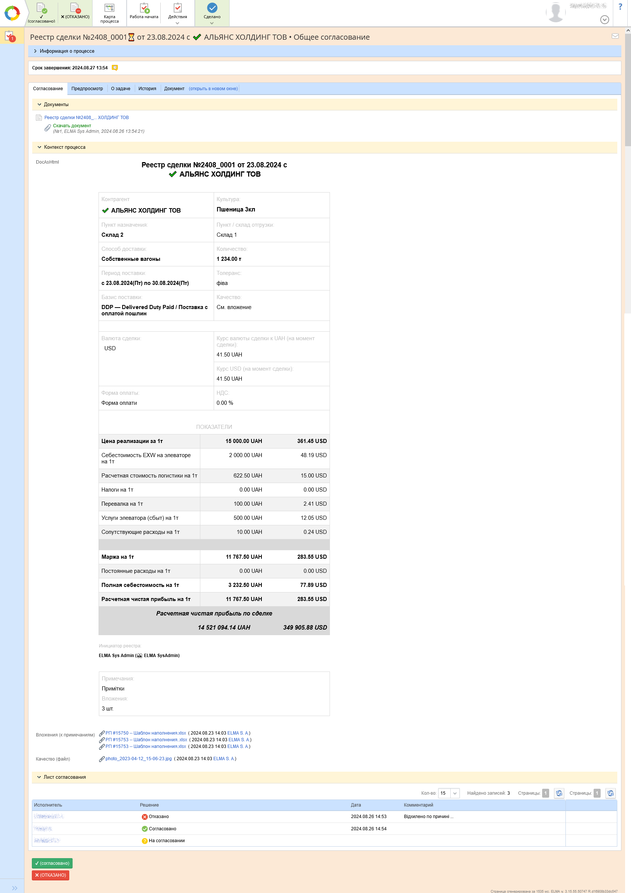
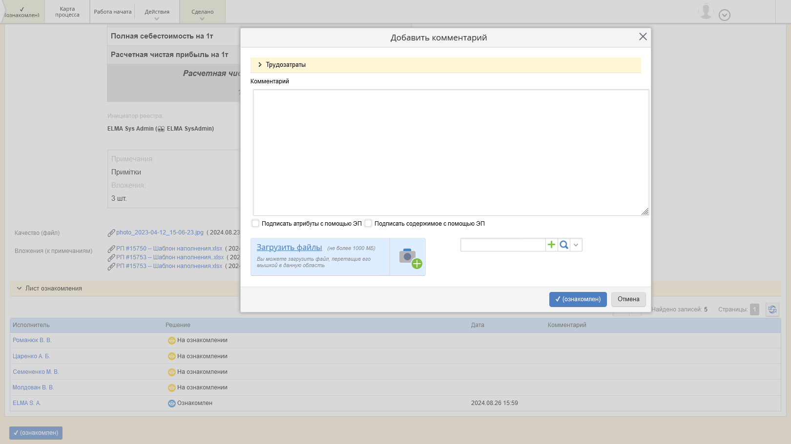

[🏠 Головна](../../../README.MD) / [⚙️ Бізнес-процеси](../../README.MD) / `24` ⚙️ Реестр сделки


# Передмова

## Матеріали для скачування

- [📥 Автодокументація по процесу](./ForDownload/AutoDoc/)
- [📥 Шаблон для генерації документу процесу](./ForDownload/DocTemplate/)
- [📥 Шаблон для генерації HTML відображення даних процесу](./ForDownload/HtmlFormTemplate/)

## Типи даних, що використовуються в процесі
- [📕 Реєстр угоди](../../../Documents/KD_DealRegister.md) `KD_DealRegister`
- [📘 Вложение](../../../Entities/Attachment.md) `Attachment`
- [📘 Контрагент](../../../Entities/Contractor.md) `Contractor`
- [📘 С/Х культура](../../../Entities/KO_AgriCulture.md) `KO_AgriCulture`
- [📘 Способ доставки](../../../Entities/KO_DeliveryMethod.md) `KO_DeliveryMethod`
- [📘 Пользователь](../../../Entities/User.md) `User`
- [🎲 Тип валюты](../../../Enums/CurrencyType.md) `CurrencyType`
- [🎲 Базис поставки](../../../Enums/DeliveryBasis.md) `DeliveryBasis`
- [🎲 Статус документу](../../../Enums/EDocStatus.md) `EDocStatus`
- [🎲 Наличие НДС](../../../Enums/KE_PresenceOfVAT.md) `KE_PresenceOfVAT`

## Логіка роботи з процесами системи ЕЛМА

Процес оперує діаграмою процесу по якій він буде рухатись та контекстом процесу.  
`Діаграма процесу` - Набір елементів процесу, що пов'язані між собою переходами. Елементами процесу можуть бути події, код, розгалудження, користувацькі задачі (які відображаються користувачам як форми), та інше.  
`Контекст процесу` - Класс що містить в собі всі змінні які будуть використовуватись під час перебігу процесу. 

Змінні з контексту процесу можуть бути будь-яким типом даних (простим, довідником, колекцією однотипних довідників, документом, табличною частиною, тощо). 
І ці змінні можна відображати на користувацьких формах (задачах процесу), при чому конкретному користувачеві відображається тільки якась певна частина з них, інша призначена іншим користувачам або ж взагалі є службовою.
Якісь змінні можу копіюватись в документ (що є продуктом процесу) а якісь ні.

Подальший опис процесу грунтується на цьому ж підході до побудови процесів

# `Процес #24` ⚙️ Реестр сделки

## Короткий опис процесу

Процес призначений для створення і погодження документу `Реєстр угоди`, що пізніше буде використовуватись як підстава до договору продажам.

---

В процесі, після його запуску, використовується `форма наповнення`, в якій ініціатор процесу задає всю необхідну інформацію, далі `форма узгодження` на якій учасники погодження можуть переглянути задану ініціатором інформацію у вигляді HTML-розмітки або ж у вигляді документа, і ще далі `форма ознайомлення` з результами погодження (максимально схожа на форму погодження)  
Таким чином в процесі використовуються:
- (відносно складна) форма наповнення реєстру, 
- HTML-відображення даних реєстру, що генерується під час перебігу процесу, 
- електронний документ реєстру з друкованою формою, що генерується під час перебігу процесу.

По суті (в найпростішому випадку) сам процес виглядає наступним чином:

`Початок` → `Z10T10 • Наповнення реєстру` → `Z20T10 • Погодження реєстру` → `Z30T10 • Ознайомлення з результатами погодження реєстру` → `Завершення`

А повна діаграма процесу виглядає як показано далі.

## Діаграма процесу


## Форма `[Z10T10] Наполнение реестра`
Після запуску процесу, його ініціатору відображається форма призначена для наповнення реєстру `[Z10T10] Наполнение реестра`.

### Форма `[Z10T10] Наполнение реестра` / Вкладка `Головна сторінка`


### Форма `[Z10T10] Наполнение реестра` / Вкладка `HTML`


**Вхідні переходи**:  
- `Z10T10_B10` — Процес прямує до одноіменного скрипту (див. діаграму процесу), де відбувається регенерація документу процесу, та HTML-форми для наглядного відображення даних процесу.

**При завантаженні форми виконується сценарій**:  
- `Z10T10_OnFormLoad(Context context, FormViewBuilder form)` - в якому відбуваєтсья переналаштування видимості, обов'язковості до заповнення та обрахунок полів, що входять до складу цієї форми.

**Вихідні переходи**:  
- `ОК` - При натисканні кнопки `На согласование` — Відображується спливаюча форма `Z10T10_A10__OK` з відображенням подальших учасників процесу (діалогове вікно по відношенню до основної форми). Після натискання кнопки `Сохранить` на цій формі, вона зникає, перевіряється заповнення всіх обов'язкових полей та процес переходить до наступного свого кроку (див. діаграму процесу)
- `Save` — При натисканні кнопки `Сохранить` — Процес переходить до наступного свого кроку (див. діаграму процесу), де відбувається регенерація документу процесу, та HTML-форми для наглядного відображення даних процесу. Перевірка обов'язковості заповнення даних не відбувається.
- `Abort`  — При натисканні кнопки `Прервать процесс` —  Відображується повідомлення чи користувач дійсно бажає перервати процес, після позитивної відповіді - процес прямує шляхом свого завершення. Перевірка обов'язковості заповнення даних не відбувається.
- `Автоматична ескалація` - По завершенню відведеного часу - процес прямує шляхом свого завершення (тобто аналогічно попередньому переходу тільки по сплинанню певного часу).


### Опис полів форми Z10T10

Опис колонки **На формі**:
- `🚫      ` — Приховано
- `  👁️    ` — Тільки для перегляду
- `     ✏️ ` — Для заповнення
- `     ✏️❗` — Для заповнення, **обов'язково**

| На формі | Назва на формі </br> `Змінна` | Тип даних </br> `Тип в коді` | Скрипт | Примітки |
| --- | --- | --- | --- | --- |
| `  👁️    ` | № реестра </br> `RegNumber` | Ціле </br> `Int64` |  | Генерується автоматично після запуску процесу у форматі 2405_0001 (рік, місяць, порядковий №) | |
| `  👁️    ` | Дата реестра </br> `Дата реестра` | Дата / время </br> `DateTime` |  | Присвоюється після запуску процесу |
| `  👁️    ` | Документ реестра </br> `RegDocument` | [📕 Реєстр угоди](../../../Documents/KD_DealRegister.md) </br> `KD_DealRegister` |  |  |
| `  👁️    ` | Инициатор реестра </br> `ProcUsrZ10_RegInitiator` | [📘 Пользователь](../../../Entities/User.md) </br> `User` |  |  |
| `     ✏️❗` | Контрагент </br> `RegContractor` | [📘 Контрагент](../../../Entities/Contractor.md) </br> `Contractor` |  |  |
| `     ✏️❗` | Форма оплаты </br> `PaymentForm` | Строка </br> `String` |  |  |
| `     ✏️❗` | Толеранс </br> `Tolerans` | Строка </br> `String` |  |  |
| `     ✏️❗` | Качество (файл)</br> `Quality` | [📘 Вкладення](../../../Entities/Attachment.md) </br> `Attachment` |  |  |
| `     ✏️❗` | Пункт / склад отгрузки </br> `PointOfShipping` | Строка </br> `String` |  |  |
| `     ✏️❗` | Пункт назначения </br> `PointOfDestination` | Строка </br> `String` |  |  |
| `     ✏️❗` | Способ доставки </br> `DeliveryMethod` | [📘 Способ доставки](../../../Entities/KO_DeliveryMethod.md) </br> `KO_DeliveryMethod` |  |  |
| `     ✏️❗` | Период поставки от ... </br> `DeliveryDateFrom` | Дата / время </br> `DateTime` |  |  |
| `     ✏️❗` | Период поставки до ... </br> `DeliveryDateTill` | Дата / время </br> `DateTime` |  |  |
| `     ✏️❗` | Базис поставки </br> `BasisOfDelivery` | [🎲 Базис поставки](../../../Enums/DeliveryBasis.md)  </br> `DeliveryBasis` |  |  |
| `     ✏️ ` | Примечания </br> `Rem` | Строка </br> `String` |  | Багатострічковий текст |
| `     ✏️ ` | Вложения (к примечаниям) </br> `RemAttachments` | 🗃Колекція<[📘 Вкладення](../../../Entities/Attachment.md)> </br> `ICollection<Attachment>` |  | Багатострічковий текст |
| `     ✏️❗` | Культура </br> `Culture` | [📘 С/Х культура](../../../Entities/KO_AgriCulture.md) </br> `KO_AgriCulture` |  |  |
| `     ✏️❗` | Количество [тоннa] </br> `Amount__tonne` | Дробное число❓  </br> `Double❓` | `🔧` Z10T10_OnPrCh____Amount__tonne</br>(Context context, FormViewBuilder form) |  |
| `     ✏️❗` | Валюта сделки (CUR) </br> `DealCUR` | [🎲 Тип валюты](../../../Enums/CurrencyType.md)❓ </br> `CurrencyType❓` | `🔧` Z10T10_OnPrCh____DealCurrency</br>(Context context, FormViewBuilder form) |  |
| `     ✏️❗` | Курс CUR к UAH </br> `CURtoUAH` | Дробное число❓  </br> `Double❓` | `🔧` Z10T10_OnPrCh____CURtoUAH</br>(Context context, FormViewBuilder form) |  |
| `     ✏️❗` | Курс USD к UAH </br> `USDtoUAH` | Дробное число❓  </br> `Double❓` | `🔧` Z10T10_OnPrCh____USDtoUAH</br>(Context context, FormViewBuilder form) |  |
| `     ✏️❗` | НДС [%] </br> `VAT__percents` | Дробное число❓  </br> `Double❓` | `🔧`  Z10T10_OnPrCh____VAT__percents</br>(Context context, FormViewBuilder form) |  |
| `  👁️    ` | * CUR_Selected </br> `CUR_Selected` | Строка </br> `String` |  |  |
| `  👁️    ` | * CUR_UAH </br> `CUR_UAH` | Строка </br> `String` |  |  |
| `     ✏️❗` | Цена реализации за 1т [CUR] </br> `SellingPricePer1ton__CUR` | Дробное число❓  </br> `Double❓` | `🔧` Z10T10_OnPrCh____SellingPricePer1ton__CUR</br>(Context context, FormViewBuilder form) |  |
| `     ✏️ ` | Цена реализации за 1т [UAH] </br> `SellingPricePer1ton__UAH` | Дробное число❓  </br> `Double❓` | `🔧` Z10T10_OnPrCh____SellingPricePer1ton__UAH</br>(Context context, FormViewBuilder form) |  |
| `     ✏️❗` | Себестоимость EXW на элеваторе на 1т [CUR] </br> `CostOfEXWatTheElevator__CUR` | Дробное число❓  </br> `Double❓` | `🔧` Z10T10_OnPrCh____CostOfEXWatTheElevator__CUR</br>(Context context, FormViewBuilder form) |  |
| `     ✏️ ` | Себестоимость EXW на элеваторе на 1т [UAH] </br> `CostOfEXWatTheElevator__UAH` | Дробное число❓  </br> `Double❓` | `🔧` Z10T10_OnPrCh____CostOfEXWatTheElevator__UAH</br>(Context context, FormViewBuilder form) |  |
| `     ✏️❗` | Расчетная стоимость логистики на 1т [CUR] </br> `EstimatedCostOfLogistics__CUR` | Дробное число❓  </br> `Double❓` | `🔧` Z10T10_OnPrCh____EstimatedCostOfLogistics__CUR</br>(Context context, FormViewBuilder form) |  |
| `     ✏️ ` | Расчетная стоимость логистики на 1т [UAH] </br> `EstimatedCostOfLogistics__UAH` | Дробное число❓  </br> `Double❓` | `🔧` Z10T10_OnPrCh____EstimatedCostOfLogistics__UAH</br>(Context context, FormViewBuilder form) |  |
| `     ✏️❗` | Налоги на 1т [CUR] </br> `TaxPer1t__CUR` | Дробное число❓  </br> `Double❓` | `🔧` Z10T10_OnPrCh____TaxPer1t__CUR</br>(Context context, FormViewBuilder form) |  |
| `     ✏️ ` | Налоги на 1т [UAH] </br> `TaxPer1t__UAH` | Дробное число❓  </br> `Double❓` | `🔧` Z10T10_OnPrCh____TaxPer1t__UAH</br>(Context context, FormViewBuilder form) |  |
| `     ✏️❗` | Перевалка на 1т [CUR] </br> `TransshipmentPer1t__CUR` | Дробное число❓  </br> `Double❓` | `🔧` Z10T10_OnPrCh____TransshipmentPer1t__CUR</br>(Context context, FormViewBuilder form) |  |
| `     ✏️ ` | Перевалка на 1т [UAH] </br> `TransshipmentPer1t__UAH` | Дробное число❓  </br> `Double❓` | `🔧` Z10T10_OnPrCh____TransshipmentPer1t__UAH</br>(Context context, FormViewBuilder form) |  |
| `     ✏️❗` | Услуги элеватора (сбыт) на 1т [CUR] </br> `ElevatorServicesPer1t__CUR` | Дробное число❓  </br> `Double❓` | `🔧` Z10T10_OnPrCh____ElevatorServicesPer1t__CUR</br>(Context context, FormViewBuilder form) |  |
| `     ✏️ ` | Услуги элеватора (сбыт) на 1т [UAH] </br> `ElevatorServicesPer1t__UAH` | Дробное число❓  </br> `Double❓` | `🔧` Z10T10_OnPrCh____ElevatorServicesPer1t__UAH</br>(Context context, FormViewBuilder form) |  |
| `     ✏️❗` | Сопутствующие расходы на 1т [CUR] </br> `AssociatedExpensesPer1t__CUR` | Дробное число❓  </br> `Double❓` | `🔧` Z10T10_OnPrCh____AssociatedExpensesPer1t__CUR</br>(Context context, FormViewBuilder form)  |  |
| `     ✏️ ` | Сопутствующие расходы на 1т [UAH] </br> `AssociatedExpensesPer1t__UAH` | Дробное число❓  </br> `Double❓` | `🔧` Z10T10_OnPrCh____AssociatedExpensesPer1t__UAH</br>(Context context, FormViewBuilder form) |  |
| `  👁️    ` | Маржа на 1т [CUR] </br> `MarginPer1t__CUR` | Дробное число❓  </br> `Double❓` |  |  |
| `  👁️    ` | Маржа на 1т [UAH] </br> `MarginPer1t__UAH` | Дробное число❓  </br> `Double❓` |  |  |
| `     ✏️ ` | Постоянные расходы на 1т [CUR] </br> `ConstantCostsPer1t__CUR` | Дробное число❓  </br> `Double❓` | Z10T10_OnPrCh____ConstantCostsPer1t__CUR</br>(Context context, FormViewBuilder form) |  |
| `     ✏️ ` | Постоянные расходы на 1т [UAH] </br> `ConstantCostsPer1t__UAH` | Дробное число❓  </br> `Double❓` | Z10T10_OnPrCh____ConstantCostsPer1t__UAH</br>(Context context, FormViewBuilder form) |  |
| `  👁️    ` | Полная себестоимость на 1т. [CUR] </br> `FullCostsPer1t__CUR` | Дробное число❓  </br> `Double❓` |  |  |
| `  👁️    ` | Полная себестоимость на 1т. [UAH] </br> `FullCostsPer1t__UAH` | Дробное число❓  </br> `Double❓` |  |  |
| `  👁️    ` | Расчетная чистая прибыль на 1т [CUR] </br> `EstimatedNetProfitPer1t__CUR` | Дробное число❓  </br> `Double❓` |  |  |
| `  👁️    ` | Расчетная чистая прибыль на 1т [UAH] </br> `EstimatedNetProfitPer1t__UAH` | Дробное число❓  </br> `Double❓` |  |  |
| `  👁️    ` | Расчетная чистая прибыль по сделке [UAH] </br> `EstimatedNetProfit__UAH` | Дробное число❓  </br> `Double❓` |  |  |
| `  👁️    ` | Расчетная чистая прибыль по сделке [USD] </br> `EstimatedNetProfit__USD` | Дробное число❓  </br> `Double❓` |  |  |
| `  👁️    ` | Total CUR </br> `LabelOfTotalCUR` | Строка </br> `String` |  |  |
| `  👁️    ` | DocAsHtml </br> `DocAsHtml` | HTML разметка  </br> `HtmlString` |  | Відображається на окремій вкладці задачі користувача |


#### Поведінка при зміні полів форми Z10T10

Детальний опис розрахунків і того як змінюється видимість та обов'язковість полів на даній формі описаний в коді процесу, проте основна логіка відбувається в двох методах:

***Методі перерахунку значень на формі***:
```cs
        private void Z10T10_Recalculate(Context context, EleWise.ELMA.Model.Views.FormViewBuilder form)
        {
            Double? variableCostPer1t__CUR = context.CostOfEXWatTheElevator__CUR
                + context.EstimatedCostOfLogistics__CUR
                + context.TaxPer1t__CUR
                + context.TransshipmentPer1t__CUR
                + context.ElevatorServicesPer1t__CUR
                + context.AssociatedExpensesPer1t__CUR;
            //Double? SellingPricePer1tonWithoutVAT__CUR = context.SellingPricePer1ton__CUR - (context.VAT__percents * context.SellingPricePer1ton__CUR / 100.00);
            Double? SellingPricePer1tonWithoutVAT__CUR = context.SellingPricePer1ton__CUR - context.VAT__percents == 0.00 ? 0.00 : (context.SellingPricePer1ton__CUR/(1+context.VAT__percents/100));
            context.MarginPer1t__CUR = SellingPricePer1tonWithoutVAT__CUR - variableCostPer1t__CUR;
            context.FullCostsPer1t__CUR = context.ConstantCostsPer1t__CUR + variableCostPer1t__CUR;
            context.EstimatedNetProfitPer1t__CUR = context.MarginPer1t__CUR - context.ConstantCostsPer1t__CUR;
            context.EstimatedNetProfit__CUR = context.EstimatedNetProfitPer1t__CUR * context.Amount__tonne;
            //
            Double? CURtoUAH = context.CURtoUAH;
            context.SellingPricePer1ton__UAH = context.SellingPricePer1ton__CUR * CURtoUAH;
            context.CostOfEXWatTheElevator__UAH = context.CostOfEXWatTheElevator__CUR * CURtoUAH;
            context.EstimatedCostOfLogistics__UAH = context.EstimatedCostOfLogistics__CUR * CURtoUAH;
            context.TaxPer1t__UAH = context.TaxPer1t__CUR * CURtoUAH;
            context.TransshipmentPer1t__UAH = context.TransshipmentPer1t__CUR * CURtoUAH;
            context.ElevatorServicesPer1t__UAH = context.ElevatorServicesPer1t__CUR * CURtoUAH;
            context.AssociatedExpensesPer1t__UAH = context.AssociatedExpensesPer1t__CUR * CURtoUAH;
            context.ConstantCostsPer1t__UAH = context.ConstantCostsPer1t__CUR * CURtoUAH;
            context.FullCostsPer1t__UAH = context.FullCostsPer1t__CUR * CURtoUAH;
            context.MarginPer1t__UAH = context.MarginPer1t__CUR * context.CURtoUAH;
            context.EstimatedNetProfitPer1t__UAH = context.EstimatedNetProfitPer1t__CUR * CURtoUAH;
            context.EstimatedNetProfit__UAH = context.EstimatedNetProfit__CUR * CURtoUAH;
            context.EstimatedNetProfit__USD = context.DealCUR == CurrencyType.USD ? context.EstimatedNetProfit__CUR
                : context.EstimatedNetProfit__UAH / context.USDtoUAH;
        }
```

де `context` - екземпляр класу самого процесу, що містить всі змінні, що використовуються під час перебігу процесу

Та ***методі оновлення налаштувань полів форми***:

```cs
        private void Z10T10_UpdatePropsSettins(Context context, EleWise.ELMA.Model.Views.FormViewBuilder form)
        {
            Boolean currencyIsUAH = context.DealCUR == CurrencyType.UAH;
            Boolean currencyIsUSD = context.DealCUR == CurrencyType.USD;
            //
            form.For(p => p.CURtoUAH).ReadOnly(currencyIsUAH);            
            form.For(p => p.USDtoUAH).Visible(!currencyIsUSD);
            //
            form.For(p => p.SellingPricePer1ton__UAH).Visible(!currencyIsUAH);
            form.For(p => p.CostOfEXWatTheElevator__UAH).Visible(!currencyIsUAH);
            form.For(p => p.EstimatedCostOfLogistics__UAH).Visible(!currencyIsUAH);
            form.For(p => p.TaxPer1t__UAH).Visible(!currencyIsUAH);
            form.For(p => p.TransshipmentPer1t__UAH).Visible(!currencyIsUAH);
            form.For(p => p.ElevatorServicesPer1t__UAH).Visible(!currencyIsUAH);
            form.For(p => p.AssociatedExpensesPer1t__UAH).Visible(!currencyIsUAH);
            form.For(p => p.ConstantCostsPer1t__UAH).Visible(!currencyIsUAH);
            form.For(p => p.MarginPer1t__UAH).Visible(!currencyIsUAH);
            form.For(p => p.EstimatedNetProfitPer1t__UAH).Visible(!currencyIsUAH);
            form.For(p => p.EstimatedNetProfit__CUR).Visible(!currencyIsUSD && !currencyIsUAH);
        }
```

Тут, звертаючись до необхідного поля і одного з його методів:
 - `ReadOnly` (тільки для читання)
 - `Visible` (видимий)
 - і ще можливо `Required` (обов'язковий)
вказуємо так чи ні для налаштування необхідної поведінки поля.

## Форма `[Z10T10_A10__OK] На согласование`


Це діалогове вікно (дочірнє до форми Z10T10) з відомостями про подальші задачі процесу та їх виконавців.  
З'являється по натисканню на кнопку `На согласование` дочірньої форми. При завантаженні форми з об'єкту конфігурації процесу зчитуються налатування про конкретних учасників стадії погодження та ознайомлення  
Всі данні тільки для читання.  
Призначено для зв'язку з адміністратором системи у випадку невідповідності учасників процесу (наприклад, через зміну орг. структури підприємства).  
`⚠️ Данні на формі відображуються у вигляді двовимірної таблиці`


## Форма `[Z20T10] Согласование`

Форма для погодження (в системі ЕЛМА) використовує штатний механізм погодження, що дозволяє налаштування:  
- Документу, що буде погоджуватись (відображається на панелі `Документы` та у вкладках `Предпросмотр` і `Документ (открыть в новом окне)`)
- Списку учасників погодження (панель `Лист согласования`)
- Та списку змінних (з контексту процесу), що будуть відображені на формі учасника погодження (панель `Контекст процесса`)



Конкретно в даному процесі в якості додаткової інформації для учасників процесу (панель `Контекст процесса`) виводяться:  
- HTML-відображення даних процесу
- Вложения (к примечаниям)
- Качество (файл)

Всі дані на формі погодження тільки на читання.

Форма погодження має два переходи: `✔️ (согласовано)` та `❌ (ОТКАЗАНО)` і відповідні кнопки для їх виконання. При натисканню на одну із можливих кнопок виводиться одне і те ж діалогове вікно з можливістю вводу:
- Приміток
- Файлових вкладень (завантаження файлів з комп'ютера користувача)
- Вкладень з документами (що містяться в системі)

Якщо користувач прийняв рішення `Відхилено` то коментарі стають обов'язковими для заповнення:


## Форма `[Z30T10] Ознакомление`

Форма для ознайомлення (в системі ЕЛМА), як і форма погодження використовує штатний механізм ознайомлення, що дозволяє налаштування:  
- Документу, що буде погоджуватись (відображається на панелі `Документы` та у вкладках `Предпросмотр` і `Документ (открыть в новом окне)`)
- Списку учасників погодження (панель `Лист согласования`)
- Та списку змінних (з контексту процесу), що будуть відображені на формі учасника погодження (панель `Контекст процесса`)


Конкретно в даному процесі в якості додаткової інформації для учасників процесу (панель `Контекст процесса`) виводяться:  
- Статус документу із документу реєстру (`⚠️ у вигляді емоджі символа` та безпосередньо статусу погодження)
- HTML-відображення даних процесу
- Вложения (к примечаниям)
- Качество (файл)

Всі дані на формі погодження тільки на читання.

Форма погодження має тільки один переход два переходи: `✔️ (ознакомлен)` і відповідну кнопку для його виконання. При натисканню на кнопоку виводиться те ж діалогове вікно що і у випадку погодження з можливістю вводу:
- Приміток
- Файлових вкладень (завантаження файлів з комп'ютера користувача)
- Вкладень з документами (що містяться в системі)



# Загальний опис генерації документу процесу

Під час генерації документу процесу або HTML форми процесу використовуються їх шаблони генерації ([📥 Шаблон для генерації документу процесу](./ForDownload/DocTemplate/), [📥 Шаблон для генерації HTML відображення даних процесу](./ForDownload/HtmlFormTemplate/)), проміжкові об'єкти стрічкового відображення даних, та контекст процесу.

Спочатку, з контексту процесу, створюється екземпляр проміжкового стрічкового відображення даних (`DealRegister_PrintForm`), цей об'єкт містить виключно стрічкові властивості і призначений для того щоб мати повний контроль над текстовим форматуванням бажаних даних (дат, чисел з плаваючою комою, переліків, тощо).  
Далі екземпляр проміжкового стрічкового відображення та документ-шаблон передається відповідному методу генерації який шукає в документі-шаблоні спеціально позначені місця, що співпадають з назвами властивостей в екземплярі об'єкта проміжкового стрічкового відображення даних, та підставляє їх значення в документ.  


Для документу процесу з контексту процесу ще додатково копіюються необхідні поля.


# Код процесу

```cs
// KP_DealRegister_Scripts
// 2023-04-04(2) 09-25
//
using EleWise.ELMA.API;
using EleWise.ELMA.Common.Models;
using EleWise.ELMA.ConfigurationModel;
using EleWise.ELMA.Diagrams;
using EleWise.ELMA.Documents.Managers;
using EleWise.ELMA.Documents.Models;
using EleWise.ELMA.Documents.Models.Nomenclature;
using EleWise.ELMA.Documents.Models.Tasks;
using EleWise.ELMA.Extensions;
using EleWise.ELMA.Files;
using EleWise.ELMA.Model.Managers;
using EleWise.ELMA.Model.Services;
using EleWise.ELMA.Runtime.Managers;
using EleWise.ELMA.Scheduling.Models;
using EleWise.ELMA.Security.Models;
using EleWise.ELMA.Services;
using EleWise.ELMA.Tasks.Models;
using EleWise.ELMA.Templates;
using EleWise.ELMA.Workflow.BPMN.Diagrams.Elements;
using EleWise.ELMA.Workflow.Managers;
using EleWise.ELMA.Workflow.Models;
using EleWise.ELMA.Workflow.Services;
using System;
using System.Collections.Generic;
using System.Globalization;
using System.IO;
using System.Linq;
using System.Text;
using BL10_ProcTask = EleWise.ELMA.Model.Entities.ProcessContext.KP_DealReg_BL10_ProcTask;
using BL1010_TaskMbr = EleWise.ELMA.Model.Entities.ProcessContext.KP_DealReg_BL10BL10_TaskMember;
using Context = EleWise.ELMA.Model.Entities.ProcessContext.KP_DealRegister;
using PC_BL10_ProcTask = EleWise.ELMA.ConfigurationModel.KO_PC_DealReg_BL10_ProcTask;
using PC_BL1010_TaskMbr = EleWise.ELMA.ConfigurationModel.KO_PC_DealReg_BL10_BL10_TaskMember;
using Kusto;
using Kusto.Elma;
using Kusto.Sys;
using Kusto.Ext.Enum;
using Kusto.Linq;
using Kusto.Ext__ContractorLegal;

namespace EleWise.ELMA.Model.Scripts
{
    public partial class KP_DealRegister_Scripts : EleWise.ELMA.Workflow.Scripts.ProcessScriptBase
    {
        #region ▬▬▬▬▬▬ Proc ▬▬▬▬▬▬▬▬▬▬▬▬▬▬▬▬▬▬▬▬▬▬▬▬▬▬▬▬▬▬▬▬▬▬▬▬▬▬▬▬▬▬▬▬▬▬▬▬▬▬▬▬▬▬▬▬▬▬▬▬▬▬▬▬▬▬▬▬▬▬▬▬▬▬▬▬▬▬▬▬▬▬▬▬▬▬▬▬▬▬▬▬▬▬▬▬▬▬▬▬▬▬▬▬▬▬▬▬▬▬▬▬▬▬▬▬▬▬▬▬▬
        //
        public virtual void Proc_AfterStart (Context context)
        {
            context.Prepare ();
            context.Save ();
        }

        //
        public virtual void Proc_BeforeStop (Context context)
        {
        }

        //
        public virtual void Proc_BeforeAbort (Context context)
        {
            if(context.RegDocument != null)
            {
                EDocStatus docStatus = context.RegDocument.DocStatus;
                HashSet breakableStatuses = new HashSet
                { 
                    EDocStatus.New,
                    EDocStatus.OnApprovement
                };
                
                if (breakableStatuses.Contains(docStatus))
                {
                    context.RegDocument.DocStatus = EDocStatus.AbortedOrNotActual;
                }
            }
            context.UpdateProcDoc();
            context.UpdateProcName();
        }

        //
        #endregion ▬▬▬ Proc
        //
        #region ▬▬▬▬▬▬ Z10 ▬▬▬▬▬▬▬▬▬▬▬▬▬▬▬▬▬▬▬▬▬▬▬▬▬▬▬▬▬▬▬▬▬▬▬▬▬▬▬▬▬▬▬▬▬▬▬▬▬▬▬▬▬▬▬▬▬▬▬▬▬▬▬▬▬▬▬▬▬▬▬▬▬▬▬▬▬▬▬▬▬▬▬▬▬▬▬▬▬▬▬▬▬▬▬▬▬▬▬▬▬▬▬▬▬▬▬▬▬▬▬▬▬▬▬▬▬▬▬▬▬▬
        //
        #region ------ Z10T10 -----------------------------------------------------------------------------------------------------------------------
        //
        public virtual void Z10T10_A01(Context context)
        {
            Proc_BeforeAbort(context);
            ContractorLegal__ExtFilter.FilterOn_UnlockedContractor(context, c => c.RegContractor);
        }


        public virtual void Z10T10_A10 (Context context)
        {
            if (context.RegDocument != null)
            {
                EDocStatus docStatus = context.RegDocument.DocStatus;
                HashSet suitableStatuses = new HashSet
                {
                    EDocStatus.New
                };

                if (suitableStatuses.Contains(docStatus))
                    context.RegDocument.DocStatus = EDocStatus.OnApprovement;
                else
                    throw new Exception("Не подходящий статус документа");
            }
            context.UpdateProcDoc ();
        }

        public virtual void Z10T10_B10 (Context context)
        {
            context.UpdateProcName ();
            context.UpdateProcDoc ();
        }

        public virtual void Z10T10_OnFormLoad (Context context, EleWise.ELMA.Model.Views.FormViewBuilder form)
        {
            Z10T10_UpdatePropsSettins(context, form);
            //Z10T10_Recalculate(context, form);
        }

        public virtual void Z10T10_OnPrCh____Amount__tonne(Context context, EleWise.ELMA.Model.Views.FormViewBuilder form)
        {
            Z10T10_Recalculate(context, form);
        }

        public virtual void Z10T10_OnPrCh____VAT__percents(Context context, EleWise.ELMA.Model.Views.FormViewBuilder form)
        {
            Z10T10_Recalculate(context, form);
        }

        public virtual void Z10T10_OnPrCh____DealCurrency(Context context, EleWise.ELMA.Model.Views.FormViewBuilder form)
        {
            Boolean currencyIsUAH = context.DealCUR == CurrencyType.UAH;
            Boolean currencyIsUSD = context.DealCUR == CurrencyType.USD;
            Boolean currencyIsEUR = context.DealCUR == CurrencyType.EUR;
            //
            context.CURtoUAH = currencyIsUAH ? (Double?)1.00 : currencyIsUSD ? context.USDtoUAH : null;
            context.USDtoUAH = currencyIsUSD ? (Double?)context.CURtoUAH : context.USDtoUAH;
            //
            context.CUR_Selected = context.DealCUR.Str();
            context.CUR_UAH = currencyIsUAH ? "" : "UAH";
            context.LabelOfTotalCUR = currencyIsEUR ? "EUR" : "";
            //
            Z10T10_Recalculate(context, form);
            Z10T10_UpdatePropsSettins(context, form);
        }

        public virtual void Z10T10_OnPrCh____CURtoUAH(Context context, EleWise.ELMA.Model.Views.FormViewBuilder form)
        {
            Boolean currencyIsUSD = context.DealCUR == CurrencyType.USD;
            if(currencyIsUSD) context.USDtoUAH = context.CURtoUAH;
            Z10T10_Recalculate(context, form);
        }

        public virtual void Z10T10_OnPrCh____USDtoUAH(Context context, EleWise.ELMA.Model.Views.FormViewBuilder form)
        {
            Z10T10_Recalculate(context, form);
        }

        public virtual void Z10T10_OnPrCh____SellingPricePer1ton__CUR(Context context, EleWise.ELMA.Model.Views.FormViewBuilder form)
        {
            //form.Notifier.Information("Цена реализации за 1т [CUR]");
            context.SellingPricePer1ton__UAH = context.SellingPricePer1ton__CUR * context.CURtoUAH;
            Z10T10_Recalculate(context, form);
        }
        

        public virtual void Z10T10_OnPrCh____SellingPricePer1ton__UAH(Context context, EleWise.ELMA.Model.Views.FormViewBuilder form)
        {
            //form.Notifier.Information("Цена реализации за 1т [UAH]");
            context.SellingPricePer1ton__CUR = context.SellingPricePer1ton__UAH / context.CURtoUAH;
            Z10T10_Recalculate(context, form);
        }
        public virtual void Z10T10_OnPrCh____CostOfEXWatTheElevator__CUR(Context context, EleWise.ELMA.Model.Views.FormViewBuilder form)
        {
            //form.Notifier.Information("Себестоимость EXW на элеваторе на 1т [CUR]");
            context.CostOfEXWatTheElevator__UAH = context.CostOfEXWatTheElevator__CUR * context.CURtoUAH;
            Z10T10_Recalculate(context, form);
        }
        public virtual void Z10T10_OnPrCh____CostOfEXWatTheElevator__UAH(Context context, EleWise.ELMA.Model.Views.FormViewBuilder form)
        {
            //form.Notifier.Information("Себестоимость EXW на элеваторе на 1т [UAH]");
            context.CostOfEXWatTheElevator__CUR = context.CostOfEXWatTheElevator__UAH / context.CURtoUAH;
            Z10T10_Recalculate(context, form);
        }
        public virtual void Z10T10_OnPrCh____EstimatedCostOfLogistics__CUR(Context context, EleWise.ELMA.Model.Views.FormViewBuilder form)
        {
            //form.Notifier.Information("Расчетная стоимость логистики на 1т [CUR]");
            context.EstimatedCostOfLogistics__UAH = context.EstimatedCostOfLogistics__CUR * context.CURtoUAH;
            Z10T10_Recalculate(context, form);
        }
        public virtual void Z10T10_OnPrCh____EstimatedCostOfLogistics__UAH(Context context, EleWise.ELMA.Model.Views.FormViewBuilder form)
        {
            //form.Notifier.Information("Расчетная стоимость логистики на 1т [UAH]");
            context.EstimatedCostOfLogistics__CUR = context.EstimatedCostOfLogistics__UAH / context.CURtoUAH;
            Z10T10_Recalculate(context, form);
        }
        public virtual void Z10T10_OnPrCh____TaxPer1t__CUR(Context context, EleWise.ELMA.Model.Views.FormViewBuilder form)
        {
            //form.Notifier.Information("Налоги на 1т [CUR]");
            context.TaxPer1t__UAH = context.TaxPer1t__CUR * context.CURtoUAH;
            Z10T10_Recalculate(context, form);
        }
        public virtual void Z10T10_OnPrCh____TaxPer1t__UAH(Context context, EleWise.ELMA.Model.Views.FormViewBuilder form)
        {
            //form.Notifier.Information("Налоги на 1т [UAH]");
            context.TaxPer1t__CUR = context.TaxPer1t__UAH / context.CURtoUAH;
            Z10T10_Recalculate(context, form);
        }
        public virtual void Z10T10_OnPrCh____TransshipmentPer1t__CUR(Context context, EleWise.ELMA.Model.Views.FormViewBuilder form)
        {
            //form.Notifier.Information("Перевалка на 1т [CUR]");
            context.TransshipmentPer1t__UAH = context.TransshipmentPer1t__CUR * context.CURtoUAH;
            Z10T10_Recalculate(context, form);
        }
        public virtual void Z10T10_OnPrCh____TransshipmentPer1t__UAH(Context context, EleWise.ELMA.Model.Views.FormViewBuilder form)
        {
            //form.Notifier.Information("Перевалка на 1т [UAH]");
            context.TransshipmentPer1t__CUR = context.TransshipmentPer1t__UAH / context.CURtoUAH;
            Z10T10_Recalculate(context, form);
        }
        public virtual void Z10T10_OnPrCh____ElevatorServicesPer1t__CUR(Context context, EleWise.ELMA.Model.Views.FormViewBuilder form)
        {
            //form.Notifier.Information("Услуги элеватора (сбыт) на 1т [CUR]");
            context.ElevatorServicesPer1t__UAH = context.ElevatorServicesPer1t__CUR * context.CURtoUAH;
            Z10T10_Recalculate(context, form);
        }
        public virtual void Z10T10_OnPrCh____ElevatorServicesPer1t__UAH(Context context, EleWise.ELMA.Model.Views.FormViewBuilder form)
        {
            //form.Notifier.Information("Услуги элеватора (сбыт) на 1т [UAH]");
            context.ElevatorServicesPer1t__CUR = context.ElevatorServicesPer1t__UAH / context.CURtoUAH;
            Z10T10_Recalculate(context, form);
        }
        public virtual void Z10T10_OnPrCh____AssociatedExpensesPer1t__CUR(Context context, EleWise.ELMA.Model.Views.FormViewBuilder form)
        {
            //form.Notifier.Information("Сопутствующие расходы на 1т [CUR]");
            context.AssociatedExpensesPer1t__UAH = context.AssociatedExpensesPer1t__CUR * context.CURtoUAH;
            Z10T10_Recalculate(context, form);
        }
        public virtual void Z10T10_OnPrCh____AssociatedExpensesPer1t__UAH(Context context, EleWise.ELMA.Model.Views.FormViewBuilder form)
        {
            //form.Notifier.Information("Сопутствующие расходы на 1т [UAH]");
            context.AssociatedExpensesPer1t__CUR = context.AssociatedExpensesPer1t__UAH / context.CURtoUAH;
            Z10T10_Recalculate(context, form);
        }
        public virtual void Z10T10_OnPrCh____ConstantCostsPer1t__CUR(Context context, EleWise.ELMA.Model.Views.FormViewBuilder form)
        {
            //form.Notifier.Information("Постоянные расходы на 1т [CUR]");
            context.ConstantCostsPer1t__UAH = context.ConstantCostsPer1t__CUR * context.CURtoUAH;
            Z10T10_Recalculate(context, form);
        }
        public virtual void Z10T10_OnPrCh____ConstantCostsPer1t__UAH(Context context, EleWise.ELMA.Model.Views.FormViewBuilder form)
        {
            //form.Notifier.Information("Постоянные расходы на 1т [UAH]");
            context.ConstantCostsPer1t__CUR = context.ConstantCostsPer1t__UAH / context.CURtoUAH;
            Z10T10_Recalculate(context, form);
        }

        private void Z10T10_UpdatePropsSettins(Context context, EleWise.ELMA.Model.Views.FormViewBuilder form)
        {
            Boolean currencyIsUAH = context.DealCUR == CurrencyType.UAH;
            Boolean currencyIsUSD = context.DealCUR == CurrencyType.USD;
            //
            form.For(p => p.CURtoUAH).ReadOnly(currencyIsUAH);            
            form.For(p => p.USDtoUAH).Visible(!currencyIsUSD);
            //
            form.For(p => p.SellingPricePer1ton__UAH).Visible(!currencyIsUAH);
            form.For(p => p.CostOfEXWatTheElevator__UAH).Visible(!currencyIsUAH);
            form.For(p => p.EstimatedCostOfLogistics__UAH).Visible(!currencyIsUAH);
            form.For(p => p.TaxPer1t__UAH).Visible(!currencyIsUAH);
            form.For(p => p.TransshipmentPer1t__UAH).Visible(!currencyIsUAH);
            form.For(p => p.ElevatorServicesPer1t__UAH).Visible(!currencyIsUAH);
            form.For(p => p.AssociatedExpensesPer1t__UAH).Visible(!currencyIsUAH);
            form.For(p => p.ConstantCostsPer1t__UAH).Visible(!currencyIsUAH);
            form.For(p => p.MarginPer1t__UAH).Visible(!currencyIsUAH);
            form.For(p => p.EstimatedNetProfitPer1t__UAH).Visible(!currencyIsUAH);
            form.For(p => p.EstimatedNetProfit__CUR).Visible(!currencyIsUSD && !currencyIsUAH);
        }

        private void Z10T10_Recalculate(Context context, EleWise.ELMA.Model.Views.FormViewBuilder form)
        {
            Double? variableCostPer1t__CUR = context.CostOfEXWatTheElevator__CUR
                + context.EstimatedCostOfLogistics__CUR
                + context.TaxPer1t__CUR
                + context.TransshipmentPer1t__CUR
                + context.ElevatorServicesPer1t__CUR
                + context.AssociatedExpensesPer1t__CUR;
            //Double? SellingPricePer1tonWithoutVAT__CUR = context.SellingPricePer1ton__CUR - (context.VAT__percents * context.SellingPricePer1ton__CUR / 100.00);
            Double? SellingPricePer1tonWithoutVAT__CUR = context.SellingPricePer1ton__CUR - context.VAT__percents == 0.00 ? 0.00 : (context.SellingPricePer1ton__CUR/(1+context.VAT__percents/100));
            context.MarginPer1t__CUR = SellingPricePer1tonWithoutVAT__CUR - variableCostPer1t__CUR;
            context.FullCostsPer1t__CUR = context.ConstantCostsPer1t__CUR + variableCostPer1t__CUR;
            context.EstimatedNetProfitPer1t__CUR = context.MarginPer1t__CUR - context.ConstantCostsPer1t__CUR;
            context.EstimatedNetProfit__CUR = context.EstimatedNetProfitPer1t__CUR * context.Amount__tonne;
            //
            Double? CURtoUAH = context.CURtoUAH;
            context.SellingPricePer1ton__UAH = context.SellingPricePer1ton__CUR * CURtoUAH;
            context.CostOfEXWatTheElevator__UAH = context.CostOfEXWatTheElevator__CUR * CURtoUAH;
            context.EstimatedCostOfLogistics__UAH = context.EstimatedCostOfLogistics__CUR * CURtoUAH;
            context.TaxPer1t__UAH = context.TaxPer1t__CUR * CURtoUAH;
            context.TransshipmentPer1t__UAH = context.TransshipmentPer1t__CUR * CURtoUAH;
            context.ElevatorServicesPer1t__UAH = context.ElevatorServicesPer1t__CUR * CURtoUAH;
            context.AssociatedExpensesPer1t__UAH = context.AssociatedExpensesPer1t__CUR * CURtoUAH;
            context.ConstantCostsPer1t__UAH = context.ConstantCostsPer1t__CUR * CURtoUAH;
            context.FullCostsPer1t__UAH = context.FullCostsPer1t__CUR * CURtoUAH;
            context.MarginPer1t__UAH = context.MarginPer1t__CUR * context.CURtoUAH;
            context.EstimatedNetProfitPer1t__UAH = context.EstimatedNetProfitPer1t__CUR * CURtoUAH;
            context.EstimatedNetProfit__UAH = context.EstimatedNetProfit__CUR * CURtoUAH;
            context.EstimatedNetProfit__USD = context.DealCUR == CurrencyType.USD ? context.EstimatedNetProfit__CUR
                : context.EstimatedNetProfit__UAH / context.USDtoUAH;
        }

        public virtual void FormOnLoad_ProcMembers (Context context, EleWise.ELMA.Model.Views.FormViewBuilder form)
        {
            context.UpdateProcMembers ();
        }

        //
        #endregion --- Z10T10
        //
        #endregion ▬▬▬ Z10
        //
        #region ▬▬▬▬▬▬ Z20 ▬▬▬▬▬▬▬▬▬▬▬▬▬▬▬▬▬▬▬▬▬▬▬▬▬▬▬▬▬▬▬▬▬▬▬▬▬▬▬▬▬▬▬▬▬▬▬▬▬▬▬▬▬▬▬▬▬▬▬▬▬▬▬▬▬▬▬▬▬▬▬▬▬▬▬▬▬▬▬▬▬▬▬▬▬▬▬▬▬▬▬▬▬▬▬▬▬▬▬▬▬▬▬▬▬▬▬▬▬▬▬▬▬▬▬▬▬▬▬▬▬▬
        //
        #region ------ Z20A10 -----------------------------------------------------------------------------------------------------------------------
        //
        public virtual void Z20A10_B10 (Context context)
        {
            context.UpdateProcMembers ();
            //ProcTask_DealRegV01 taskCode = ProcTask_DealRegV01.Z20_A10;
            ////
            //PC_BL10_ProcTask procTask = context.ProcConfig ().BL10_ProcTasks.Where (e => e.BI_TaskCode == taskCode).First ();
            //context.ApprTimer = TimeSpan.FromMinutes (context.ProcConfig ().Appr_MinutesPerTick);
            //context.ApprEscalationTime = DateTime.Now + TimeSpan.FromMinutes (procTask.BI_TimeLimit__inTick * context.ProcConfig ().Appr_MinutesPerTick);
            //context.ApprTimeTimit = context.ApprEscalationTime;
            //context.SendNotification_YouHaveBrteakableApprTask (taskCode);
        }

        

        //
        public virtual void Z20A10_A10 (Context context)
        {
            //context.BreakActiveTimer ("Z20A10_Timer");
            //ProcTask_DealRegV01 taskCode = ProcTask_DealRegV01.Z20_A10;
            //Aux_DocApprInfo apprInfo = context.RegDocument.GetApprResult ();
            //BL10_ProcTask procTask = context.GetProcTask (taskCode);
            //procTask.BI_TaskCompleted = true;
            //Dictionary executor_result = apprInfo.DocApprInfoItems.ToDictionary (k => k.Executor.Id);
            //foreach (BL1010_TaskMbr tMbr in procTask.BL10_TaskMembers.ToList ()) {
            //    tMbr.BI_ApprResult = executor_result [tMbr.BI_ApprMember.Id].Executor_Solution;
            //}
            context.UpdateProcDoc ();
        }
        //
        public virtual void AfterAppr(Context context)
        {
            if (context.RegDocument != null)
            {
                EDocStatus docStatus = context.RegDocument.DocStatus;
                HashSet suitableStatuses = new HashSet
                {
                    EDocStatus.OnApprovement
                };
                if (!suitableStatuses.Contains(docStatus))
                    throw new Exception("Не подходящий статус документа");
                Boolean allConfirmed = context.RegDocument.GetApprResult().DocApprInfoItems.All(e => e.Executor_Solution == ApprovalStatus.Confirm);
                context.RegDocument.DocStatus = allConfirmed ? EDocStatus.Approved : EDocStatus.Refused;
            }
            context.UpdateProcDoc();
            context.UpdateProcName();
        }
        //
        #endregion --- Z20A10
        //
        #endregion ▬▬▬ Z20
        //
        #region ▬▬▬▬▬▬ Z30 ▬▬▬▬▬▬▬▬▬▬▬▬▬▬▬▬▬▬▬▬▬▬▬▬▬▬▬▬▬▬▬▬▬▬▬▬▬▬▬▬▬▬▬▬▬▬▬▬▬▬▬▬▬▬▬▬▬▬▬▬▬▬▬▬▬▬▬▬▬▬▬▬▬▬▬▬▬▬▬▬▬▬▬▬▬▬▬▬▬▬▬▬▬▬▬▬▬▬▬▬▬▬▬▬▬▬▬▬▬▬▬▬▬▬▬▬▬▬▬▬▬▬
        //
        #region ------ Z30T10 -----------------------------------------------------------------------------------------------------------------------
        //
        public virtual void Z30T10_B10 (Context context)
        {
        }

        //
        public virtual void Z30T10_A10 (Context context)
        {
        }

        //
        #endregion --- Z30T10
        //
        #endregion ▬▬▬ Z30
        //
    }
    public static class Ext_Context
    {
        private const Int64 ProcConfigKey = 1;

        private readonly static DateTime MinProcDate = new DateTime (2022, 10, 14, 09, 25, 00);

        public static Attachment UpdateRegDocApprList (this Context context)
        {
            IApprovementTaskGroup AppGroup = ApprovementTaskGroupManager.Instance.GetGroupsByDocument (context.RegDocument).LastOrDefault ();
            if (AppGroup == null)
                return null;
            //    
            context.RegDocApprList = PublicAPI.Docflow.Objects.Tasks.ApprovementList.ApprovementListToPdf (context.RegDocument);
            context.RegDocApprList.File.Name = String.Format ("Лист согласования документа [{0}]", context.ProcName);
            return context.RegDocApprList;
        }

        public static KD_DealRegister UpdateProcDoc (this Context context)
        {
            KD_DealRegister procDoc = context.RegDocument;
            if (procDoc == null) {
                procDoc = EntityManager.Instance.Find (e => e.RegNumber == context.GetProcNumber ()).FirstOrDefault ();
                context.RegDocument = procDoc;
            }
            //
            if (procDoc == null) {
                BinaryFile docFile = Ext_BinaryFile.CreateEmptyBinaryFile ("Пустой файл");
                Folder docDir = Ext_Folder.Cd ("Реестры сделок").Cd ("{0:yyyy}", context.RegDate).Cd ("{0:MM} ({0:MMMM})", context.RegDate).Cd (context.ProcName);
                procDoc = PublicAPI.Docflow.Types.UserKD_DealRegister.Create (docFile, docDir, context.UpdateProcName ());
                procDoc.RegNumber = context.GetProcNumber ();
                procDoc.RegDate = context.GetProcDate ();
                procDoc.RegInitiator = context.ProcUsrZ10_RegInitiator;
                //
                context.RegDocument = procDoc;
            }
            //
            procDoc.CurrentVersion.File = Ext_BinaryFile.GenerateFromTemplate (new DealRegister_PrintForm (context), context.ProcConfig ().FilePath_RegPrintForm, context.ProcName);
            var htmlFile = Ext_BinaryFile.GenerateFromTemplate(new DealRegister_PrintForm(context), @"C:\ELMA-KustoAgro-DocumentTemplates\DealReg\DealReg v02.html", context.ProcName);
            context.DocAsHtml = new System.Web.HtmlString(System.IO.File.ReadAllText(htmlFile.ContentFilePath));
            //
            procDoc.Name = context.UpdateProcName ();
            procDoc.Folder.Name = procDoc.Name;
            //
            procDoc.Rem = context.Rem;
            procDoc.RemAttachments.Clear ();
            procDoc.RemAttachments.AddAll (context.RemAttachments);
            procDoc.Contractor = context.RegContractor;
            procDoc.Culture = context.Culture;
            procDoc.Amount__tonne = context.Amount__tonne;
            procDoc.PaymentForm = context.PaymentForm;
            procDoc.Tolerans = context.Tolerans;
            procDoc.Quality = context.Quality;
            procDoc.PointOfShipping = context.PointOfShipping;
            procDoc.PointOfDestination = context.PointOfDestination;
            procDoc.DeliveryMethod = context.DeliveryMethod;
            procDoc.DeliveryDateFrom = context.DeliveryDateFrom;
            procDoc.DeliveryDateTill = context.DeliveryDateTill;
            procDoc.BasisOfDelivery = context.BasisOfDelivery;
            procDoc.VAT__percents = context.VAT__percents;
            procDoc.DealCUR = context.DealCUR;
            procDoc.CURtoUAH = context.CURtoUAH;
            procDoc.USDtoUAH = context.USDtoUAH;
            procDoc.SellingPricePer1ton__CUR = context.SellingPricePer1ton__CUR;
            procDoc.SellingPricePer1ton__UAH = context.SellingPricePer1ton__UAH;
            procDoc.CostOfEXWatTheElevator__CUR = context.CostOfEXWatTheElevator__CUR;
            procDoc.CostOfEXWatTheElevator__UAH = context.CostOfEXWatTheElevator__UAH;
            procDoc.EstimatedCostOfLogistics__CUR = context.EstimatedCostOfLogistics__CUR;
            procDoc.EstimatedCostOfLogistics__UAH = context.EstimatedCostOfLogistics__UAH;
            procDoc.TaxPer1t__CUR = context.TaxPer1t__CUR;
            procDoc.TaxPer1t__UAH = context.TaxPer1t__UAH;
            procDoc.TransshipmentPer1t__CUR = context.TransshipmentPer1t__CUR;
            procDoc.TransshipmentPer1t__UAH = context.TransshipmentPer1t__UAH;
            procDoc.ElevatorServicesPer1t__CUR = context.ElevatorServicesPer1t__CUR;
            procDoc.ElevatorServicesPer1t__UAH = context.ElevatorServicesPer1t__UAH;
            procDoc.AssociatedExpensesPer1t__CUR = context.AssociatedExpensesPer1t__CUR;
            procDoc.AssociatedExpensesPer1t__UAH = context.AssociatedExpensesPer1t__UAH;
            procDoc.MarginPer1t__CUR = context.MarginPer1t__CUR;
            procDoc.MarginPer1t__UAH = context.MarginPer1t__UAH;
            procDoc.ConstantCostsPer1t__CUR = context.ConstantCostsPer1t__CUR;
            procDoc.ConstantCostsPer1t__UAH = context.ConstantCostsPer1t__UAH;
            procDoc.FullCostsPer1t__CUR = context.FullCostsPer1t__UAH;
            procDoc.FullCostsPer1t__UAH = context.FullCostsPer1t__UAH;
            procDoc.EstimatedNetProfitPer1t__CUR = context.EstimatedNetProfitPer1t__CUR;
            procDoc.EstimatedNetProfitPer1t__UAH = context.EstimatedNetProfitPer1t__UAH;
            procDoc.EstimatedNetProfit__CUR = context.EstimatedNetProfit__CUR;
            procDoc.EstimatedNetProfit__UAH = context.EstimatedNetProfit__UAH;
            procDoc.EstimatedNetProfit__USD = context.EstimatedNetProfit__USD;
            //
            //
            procDoc.ApprovementList = context.UpdateRegDocApprList ();
            //
            return procDoc;
        }

        public static String UpdateProcName (this Context context)
        {
            EDocStatus docStatus = context.RegDocument == null ? EDocStatus.New : context.RegDocument.DocStatus;
            String procName = String.Format ("Реестр сделки №{0}{1} от {2} с {3}"
                , context.GetProcNumber().Str(StrFormat.DocNumb)
                , docStatus.Sign()
                , context.GetProcDate().Str(StrFormat.Date)
                , context.RegContractor);
            context.ProcName = procName;
            return procName;
        }

        /// Получить объект конфигурации процесса 
        public static KO_PC_DealReg ProcConfig (this Context context)
        {
            KO_PC_DealReg procConfig = context.ProcConfing;
            if (procConfig == null) {
                procConfig = EntityManager.Instance.Find (e => e.Key == ProcConfigKey && e.Actuality == KE_Actuality.Actual).FirstOrDefault ();
                context.ProcConfing = procConfig;
            }
            if (procConfig == null) {
                procConfig = EntityManager.Create ();
                //
                procConfig.Key = ProcConfigKey;
                procConfig.Actuality = KE_Actuality.Actual;
                procConfig.Remarks = "Создано автоматически";
                procConfig.FilePath_RegPrintForm = String.Empty;
                procConfig.Appr_MinutesPerTick = 20;
                //
                PC_BL10_ProcTask procTask_z20a10 = EntityManager.Create ();
                procTask_z20a10.BI_TaskCode = ProcTask_DealRegV01.Z20_A10;
                procTask_z20a10.BI_TimeLimit__inTick = 9;
                procTask_z20a10.BI_TaskName = "Согласование 01";
                procConfig.BL10_ProcTasks.Add (procTask_z20a10);                
                //
                context.ProcConfing = procConfig;
            }
            return procConfig;
        }

        /// Получить дату процесса 
        public static DateTime GetProcDate (this Context context)
        {
            DateTime procDate = context.RegDate;
            if (procDate < MinProcDate) {
                procDate = DateTime.Now;
                context.RegDate = procDate;
            }
            return procDate;
        }

        public static Int64 GetProcNumber (this Context context)
        {
            Int64 procNumber = context.RegNumber;
            if (procNumber < 1) {
                Numerator numerator = context.ProcConfig ().ProcNumerator;
                DateTime currentTime = DateTime.Now;
                //
                Int64 docYear = numerator.Value / 1000000;
                Int64 docMonth = numerator.Value / 10000 % 100;
                //
                Int32 currentYear = currentTime.Year % 100;
                Int32 currentMonth = currentTime.Month;
                if(docYear < currentYear || docMonth < currentMonth)
                {
                    numerator.Value = (currentYear * 100 + currentMonth) * 10000 + 1;
                    numerator.Save();
                    procNumber = numerator.Value;
                }
                else procNumber = NumeratorManager.Instance.GetNewId(numerator, true);
                context.RegNumber = procNumber;
            }
            return procNumber;
        }

        public static void Prepare (this Context context)
        {
            KO_PC_DealReg procConfig = context.ProcConfig ();
            Numerator numerator = procConfig.ProcNumerator;
            if (numerator == null) {
                const Int64 numeratorIncrement = 1;
                const String DocTypeName = "Реестр сделки";
                numerator = NumeratorManager.Instance.CreateNumerator (numeratorIncrement) as Numerator;
                numerator.Name = String.Format ("Нумератор \"{0}\"", DocTypeName);
                numerator.Description = String.Format ("Нумератор для документов типа \"{0}\"", DocTypeName);
                numerator.IsUser = true;
                procConfig.ProcNumerator = numerator;
            }
        }

        public static void UpdateProcMembers (this Context context)
        {
            KO_PC_DealReg procConfig = context.ProcConfig ();
            List taskCodes = Enum.GetValues (typeof(ProcTask_DealRegV01)).Cast ().OrderBy (e => e).ToList ();
            foreach (ProcTask_DealRegV01 taskCode in taskCodes) {
                if (taskCode < ProcTask_DealRegV01.Z20_A10 || taskCode > ProcTask_DealRegV01.Z30_T10)
                    continue;
                BL10_ProcTask procTask = context.BL10_ProcTasks.Where (t => t.BI_ProcTaskCode == taskCode).FirstOrDefault ();
                if (procTask == null) {
                    procTask = EntityManager.Create ();
                    procTask.BI_TaskCompleted = false;
                    procTask.BI_ProcTaskCode = taskCode;
                    context.BL10_ProcTasks.Add (procTask);
                }
                if (procTask.BI_TaskCompleted == true)
                    continue;
                //
                PC_BL10_ProcTask procTaskSettings = procConfig.BL10_ProcTasks.Where (t => t.BI_TaskCode == taskCode).FirstOrDefault ();
                if (procTaskSettings == null)
                    throw new InvalidOperationException ();
                else
                    procTask.BI_TaskName = procTaskSettings.BI_TaskName;
                procTask.BL10_TaskMembers.Clear ();
                foreach (PC_BL1010_TaskMbr taskMembersSettings in procTaskSettings.BL10_TaskMembers.ToList ()) {
                    BL1010_TaskMbr taskMbr = EntityManager.Create ();
                    taskMbr.BI_ApprMember = taskMembersSettings.BI_ApprMember.User;
                    taskMbr.BI_ProhibitEscalation = taskMembersSettings.BI_ProhibitEscalation;
                    procTask.BL10_TaskMembers.Add (taskMbr);
                }
            }
            //
            BL10_ProcTask procTaskZ20A10 = context.BL10_ProcTasks.Where (t => t.BI_ProcTaskCode == ProcTask_DealRegV01.Z20_A10).FirstOrDefault ();
            if (procTaskZ20A10 != null && !procTaskZ20A10.BI_TaskCompleted) {
                context.ProcUsrZ20_ApprMembers10.Clear ();
                context.ProcUsrZ20_ApprMembers10.AddAll (procTaskZ20A10.BL10_TaskMembers.Select (tm => tm.BI_ApprMember));
            }            
            BL10_ProcTask procTaskZ30T10 = context.BL10_ProcTasks.Where (t => t.BI_ProcTaskCode == ProcTask_DealRegV01.Z30_T10).FirstOrDefault ();
            if(procTaskZ30T10 == null)
            {
                procTaskZ30T10 = EntityManager.Create();
                context.BL10_ProcTasks.Add(procTaskZ30T10);
                procTaskZ30T10.BI_TaskCompleted = false;
                procTaskZ30T10.BI_ProcTaskCode = ProcTask_DealRegV01.Z30_T10;
            }
            if(procTaskZ30T10.BL10_TaskMembers.Any(e => e.BI_ApprMember.Id == context.ProcUsrZ10_RegInitiator.Id) == false)
            {
                BL1010_TaskMbr taskMbr = EntityManager.Create();
                procTaskZ30T10.BL10_TaskMembers.Add(taskMbr);
                taskMbr.BI_ApprMember = context.ProcUsrZ10_RegInitiator;
                taskMbr.BI_ProhibitEscalation = true;
            }
            if (procTaskZ30T10 != null && !procTaskZ30T10.BI_TaskCompleted) {
                context.ProcUsrZ30_AcqMembers10.Clear ();
                context.ProcUsrZ30_AcqMembers10.AddAll (procTaskZ30T10.BL10_TaskMembers.Select (tm => tm.BI_ApprMember));
                //context.ProcUsrZ30_AcqMembers10.Add(context.ProcUsrZ10_RegInitiator);
            }
        }

        public static Boolean ShouldContinueApprManagement (this Context context)
        {
            return context.ApprEscalationTime != null && context.GetActiveDocumentApprovementTasks ().Count > 0;
        }

        public static Boolean CanBreakApprovementTasks (this Context context, ProcTask_DealRegV01 taskCode)
        {
            if (context.ApprEscalationTime == null)
                return false;
            if (context.ApprEscalationTime > DateTime.Now)
                return false;
            PC_BL10_ProcTask taskSettings = context.ProcConfig ().BL10_ProcTasks.Where (t => t.BI_TaskCode == taskCode).FirstOrDefault ();
            if (taskSettings != null && taskSettings.BI_TimeLimit__inTick <= 0)
                return false;
            List activeApprTasks = context.GetActiveDocumentApprovementTasks ();
            BL10_ProcTask taskInfo = context.BL10_ProcTasks.Where (t => t.BI_ProcTaskCode == taskCode).FirstOrDefault ();
            if (taskInfo == null)
                return false;
            HashSet unbreakableApprUsrsIds = new HashSet (taskInfo.BL10_TaskMembers.Where (tm => tm.BI_ProhibitEscalation == true).Select (e => e.BI_ApprMember.Id));
            if (activeApprTasks.Any (at => unbreakableApprUsrsIds.Contains (at.ExecutorOriginal.Id)))
                return false;
            //
            return true;
        }

        public static void BreakApprovement (this Context context, String connectorName, ApprovalStatus apprStatus)
        {
            List activeTasks = PublicAPI.Processes.WorkflowTaskBase.Filter ().InstanceId (context.WorkflowInstance.Id)
                .Statuses (TaskBaseExtensions.ActiveTaskStatuses.ToList ()).Find ().ToList ();
            if (activeTasks == null || activeTasks.Count < 0)
                return;
            DateTime currentDate = DateTime.Now;
            foreach (TaskBase item in activeTasks) {
                DocumentApprovementTask task = item as DocumentApprovementTask;
                if (task == null)
                    continue;
                BPMNFlowElement element = (BPMNFlowElement)task.WorkflowBookmark.Instance.Process.Diagram.Elements.Single (x => x.Uid == task.WorkflowBookmark.ElementUid);
                Connector connector = element.OutputConnectors.FirstOrDefault (x => x.Name == connectorName);
                if (connector == null)
                    throw new NullReferenceException ("connector");
                //
                task.ApprovalStatus = ApprovalStatus.Confirm;
                task.StartWorkDate = DateTime.Now - TimeSpan.FromMinutes (1);
                task.EndWorkDate = DateTime.Now;
                task.Status = TaskBaseStatus.Complete;
                ApprovementTaskGroup apprGroup = task.Group;
                apprGroup.Status = ApprovalStatus.Confirm;
                apprGroup.SolutionDate = DateTime.Now;
                ApprovementListItem i = apprGroup.ApprovementList.Items.Where (x => x.User.Id == (task.IsEmulation ? task.ExecutorIsEmulation.Id : task.Executor.Id)).First ();
                i.Results.First ().Status = apprStatus;
                i.SelectedConnectorUid = connector.Uid;
                i.Comment = "🔴 РЕШЕНИЕ ПРИНЯТО АВТОМАТИЧЕСКИ (истекло отведенное время)";
                i.SolutionDate = currentDate;
                WorkflowTaskExecuteData executeData = new WorkflowTaskExecuteData (task, connector.Uid);
                Locator.GetServiceNotNull ().Execute (executeData);
            }
            context.ApprTimer = TimeSpan.FromSeconds (5);
        }

        public static void SendNotification_YouHaveBrteakableApprTask (this Context context, ProcTask_DealRegV01 taskCode)
        {
            if (context.ApprEscalationTime == null)
                return;
            BL10_ProcTask taskInfo = context.BL10_ProcTasks.Where (t => t.BI_ProcTaskCode == taskCode).FirstOrDefault ();
            HashSet breakableApprUsrs = new HashSet (taskInfo.BL10_TaskMembers.Where (tm => tm.BI_ProhibitEscalation == false).Select (e => e.BI_ApprMember));
            if (breakableApprUsrs.Count == 0)
                return;
            String msgSubject = "[#ELMA] [#Реестр сделки] Запущено ограниченное по времени согласование";
            foreach (User usr in breakableApprUsrs) {
                String msgText = String.Format ("Уважаемый(ая) {0}! \n\n" + "Вы являетесь участником ограниченного по времени согласования документа {1}" + "\n\nЕсли вы не успеете согласовать документ до {2:yyyy.MM.dd(ddd) HH:mm} документ будет согласован автоматически (за вас; с положительным результатом).", usr.FullName, context.RegDocument, context.ApprEscalationTime);
                PublicAPI.Portal.Messages.MessageBuilder (msgSubject).MessageText (msgText).Recipients (usr).SendMessage ();
            }
        }

        public static BL10_ProcTask GetProcTask (this Context context, ProcTask_DealRegV01 taskCode)
        {
            BL10_ProcTask procTask = context.BL10_ProcTasks.FirstOrDefault (t => t.BI_ProcTaskCode == taskCode);
            if (procTask == null)
                throw new NullReferenceException (String.Format ("Не удалось найти задачу процесса "));
            return procTask;
        }

        public static void UpdateDealRegDocApprStatus (this Context context)
        {
            //TODO ***
            Boolean apprResult = false;
            //IEnumerable apprGroups = PublicAPI.Docflow.Tasks.GetApprovementGroupsByDocument(context.RegDocument);
            //var solutionResults = apprGroups
            //    .SelectMany(x => x.ApprovementList.Items)
            //    .SelectMany(y => y.Results)
            //    .Select(z => new 
            //    { 
            //        User = z.Item.User,
            //        SolutionDate = z.Item.SolutionDate,
            //        Solution = z.Status,
            //        Remark = z.Item.Comment
            //    }).ToDictionary(k => k.User.Id);
            //Boolean regIsApproved = !(context.GetProcTask(ProcTask_DealRegV01.Z20_A30).BL10_TaskMembers.Any(memb => memb.BI_ApprResult == ApprovalStatus.Unconfirm));
            IEnumerable apprTaskGroups = PublicAPI.Docflow.Tasks.GetApprovementGroupsByDocument (context.RegDocument);
            PublicAPI.Services.Security.RunBySystemUser (() =>  {
                foreach (ApprovementTaskGroup apprTaskGroup in apprTaskGroups) {
                    apprTaskGroup.Status = ApprovalStatus.Confirm;
                    apprTaskGroup.Save ();
                }
            });
            //if (regIsApproved)
            //{
            //    //foreach(var item in apprGroups.SelectMany(g => g.ApprovementList.Items).SelectMany(r => r.Results).ToList())
            //    //{
            //    //    item.Status = ApprovalStatus.Confirm;
            //    //    item.Save();
            //    //}
            //    apprTaskGroups.ForEach(e => e.Status = ApprovalStatus.Confirm);
            //    //foreach(var task in apprGroups.SelectMany(g => g.Tasks).ToList())
            //    //{
            //    //    task.ApprovalStatus = ApprovalStatus.Confirm;
            //    //    foreach (ApprovementResult res in task.ListItem.Results.ToList())
            //    //    {
            //    //        res.Status = ApprovalStatus.Confirm;
            //    //        res.Save();
            //    //    }
            //    //}
            //}
        }
    }
    public class DealRegister_PrintForm
    {
        public String RegNumber { get; set; }
        public String RegDate { get; set; }
        public String Contractor { get; set; }
        public String Culture { get; set; }
        public String Amount__Tonne { get; set; }
        public String Tolerans { get; set; }
        public String Quality { get; set; }
        public String DealCUR { get; set; }
        public String CURtoUAH { get; set; }
        public String USDtoUAH { get; set; }
        public String RegInitiator { get; set; }
        public String Rem { get; set; }
        public String RemAttachments { get; set; }
        public String PaymentForm { get; set; }
        public String PointOfShipping { get; set; }
        public String PointOfDestination { get; set; }
        public String DeliveryMethod { get; set; }
        public String DeliveryDate { get; set; }
        public String BasisOfDelivery { get; set; }
        public String VAT__percents { get; set; }
        public String SellingPricePer1ton__CUR { get; set; }
        public String SellingPricePer1ton__UAH { get; set; }
        public String CostOfEXWatTheElevator__CUR { get; set; }
        public String CostOfEXWatTheElevator__UAH { get; set; }
        public String EstimatedCostOfLogistics__CUR { get; set; }
        public String EstimatedCostOfLogistics__UAH { get; set; }
        public String TaxPer1t__CUR { get; set; }
        public String TaxPer1t__UAH { get; set; }
        public String TransshipmentPer1t__CUR { get; set; }
        public String TransshipmentPer1t__UAH { get; set; }
        public String ElevatorServicesPer1t__CUR { get; set; }
        public String ElevatorServicesPer1t__UAH { get; set;}
        public String AssociatedExpensesPer1t__CUR { get; set; }
        public String AssociatedExpensesPer1t__UAH { get; set; }
        public String MarginPer1t__CUR { get; set; }
        public String MarginPer1t__UAH { get; set; }
        public String ConstantCostsPer1t__CUR { get; set; }
        public String ConstantCostsPer1t__UAH { get; set; }
        public String FullCostsPer1t__CUR { get; set; }
        public String FullCostsPer1t__UAH { get; set; }
        public String EstimatedNetProfitPer1t__CUR { get; set; }
        public String EstimatedNetProfitPer1t__UAH { get; set; }
        public String EstimatedNetProfit__CUR { get; set; }
        public String EstimatedNetProfit__UAH { get; set; }
        public String EstimatedNetProfit__USD { get; set; }

        public DealRegister_PrintForm (Context c)
        {
            RegNumber = c.RegNumber.Str (StrFormat.DocNumb);
            RegDate = c.RegDate.Str(StrFormat.Date);
            RegInitiator = c.ProcUsrZ10_RegInitiator.Str();
            Rem = c.Rem.IfEmpty("<Не указанны>");
            RemAttachments = c.RemAttachments.IfEmpty("<Отсутствуют>");
            Contractor = c.RegContractor == null ? "<Не указанно>" : c.RegContractor.Name;
            Culture = c.Culture == null ? "<Не указанно>" : c.Culture.Name;
            Amount__Tonne = c.Amount__tonne.Str(StrFormat.Double + " т");
            PaymentForm = c.PaymentForm;
            Tolerans = c.Tolerans.IfEmpty("<Не указанно>");
            Quality = c.Quality == null ? "<Не указанно>" : "См. вложение";
            PointOfShipping = c.PointOfShipping;
            PointOfDestination = c.PointOfDestination;
            DeliveryMethod = c.DeliveryMethod == null ? "<Не указанно>" : c.DeliveryMethod.Name;
            DeliveryDate = "с " + c.DeliveryDateFrom.Str(StrFormat.DateFull) + " по " + c.DeliveryDateTill.Str(StrFormat.DateFull);
            BasisOfDelivery = c.BasisOfDelivery.Str().IfEmpty("<Не указанно>");
            VAT__percents = c.VAT__percents.StrMU("%");
            DealCUR = " " + c.DealCUR.Str().IfEmpty("<Не указанно>");
            CURtoUAH = c.CURtoUAH.StrMU("UAH");
            USDtoUAH = c.DealCUR != CurrencyType.USD ? c.USDtoUAH.Str() + " UAH" : CURtoUAH;
            String uah = c.DealCUR == CurrencyType.UAH ? "" : " UAH";
            SellingPricePer1ton__CUR = c.SellingPricePer1ton__CUR.StrMU(DealCUR);
            SellingPricePer1ton__UAH = c.SellingPricePer1ton__UAH.StrMU(uah);
            CostOfEXWatTheElevator__CUR = c.CostOfEXWatTheElevator__CUR.StrMU(DealCUR);
            CostOfEXWatTheElevator__UAH = c.CostOfEXWatTheElevator__UAH.StrMU(uah);
            EstimatedCostOfLogistics__CUR = c.EstimatedCostOfLogistics__CUR.StrMU(DealCUR);
            EstimatedCostOfLogistics__UAH = c.EstimatedCostOfLogistics__UAH.StrMU(uah);
            TaxPer1t__CUR = c.TaxPer1t__CUR.StrMU(DealCUR);
            TaxPer1t__UAH = c.TaxPer1t__UAH.StrMU(uah);
            TransshipmentPer1t__CUR = c.TransshipmentPer1t__CUR.StrMU(DealCUR);
            TransshipmentPer1t__UAH = c.TransshipmentPer1t__UAH.StrMU(uah);
            ElevatorServicesPer1t__CUR = c.ElevatorServicesPer1t__CUR.StrMU(DealCUR);
            ElevatorServicesPer1t__UAH = c.ElevatorServicesPer1t__UAH.StrMU(uah);
            AssociatedExpensesPer1t__CUR = c.AssociatedExpensesPer1t__CUR.StrMU(DealCUR);
            AssociatedExpensesPer1t__UAH = c.AssociatedExpensesPer1t__UAH.StrMU(uah);
            MarginPer1t__CUR = c.MarginPer1t__CUR.StrMU(DealCUR);
            MarginPer1t__UAH = c.MarginPer1t__UAH.StrMU(uah);
            ConstantCostsPer1t__CUR = c.ConstantCostsPer1t__CUR.StrMU(DealCUR);
            ConstantCostsPer1t__UAH = c.ConstantCostsPer1t__UAH.StrMU(uah);
            FullCostsPer1t__CUR = c.FullCostsPer1t__CUR.StrMU(DealCUR);
            FullCostsPer1t__UAH = c.FullCostsPer1t__UAH.StrMU(uah);
            EstimatedNetProfitPer1t__CUR = c.EstimatedNetProfitPer1t__CUR.StrMU(DealCUR);
            EstimatedNetProfitPer1t__UAH = c.EstimatedNetProfitPer1t__UAH.StrMU(uah);
            EstimatedNetProfit__CUR = c.EstimatedNetProfit__CUR.StrMU(DealCUR);
            EstimatedNetProfit__UAH = c.EstimatedNetProfit__UAH.StrMU(uah);
            EstimatedNetProfit__USD = c.EstimatedNetProfit__USD.StrMU(c.DealCUR != CurrencyType.USD ? "USD" : "");
        }
    }
    
    public static class Ext_BinaryFile
    {
        /// 
 Генерировать бинарный файл по шаблону 

        ///  Источник данных 
        ///  Дата создания 
        ///  Полный путь к месту хранения шаблона файла (с расширением) 
        ///  Название которое будет присвоено созданному файлу (без расширения) 
        /// 
        public static BinaryFile GenerateFromTemplate (Object dataSource, String pathToTemplateFile, String fileNameWithoutExtension, DateTime? creationDate = null)
        {
            String fileExtension = Path.GetExtension (pathToTemplateFile);
            BinaryFile binFile = InterfaceActivator.Create ();
            binFile.Name = String.Format ("{0}.{1}", fileNameWithoutExtension, fileExtension);
            binFile.CreateDate = creationDate ?? DateTime.Now;
            binFile.InitializeContentFilePath ();
            System.IO.File.Copy (pathToTemplateFile, binFile.ContentFilePath);
            //
            var generator = Locator.GetServiceNotNull ().Create (binFile.ContentFilePath);
            generator.Generate (dataSource);
            Locator.GetServiceNotNull ().SaveFile (binFile);
            return binFile;
        }

        /// Создать пустой бинарный файл 

        ///  Название файла (без расширения) 
        public static BinaryFile CreateEmptyBinaryFile (String fileNameWithoutExtension)
        {
            string fileName = String.Format ("{0}.tmp", string.Join ("_", fileNameWithoutExtension.Split (Path.GetInvalidFileNameChars ())));
            byte[] fileBody = new byte[] {

            };
            var filePath = BinaryFile.CreateContentFilePath (fileName);
            System.IO.File.WriteAllBytes (filePath, fileBody);
            var mimeMappingService = Locator.GetServiceNotNull ();
            BinaryFile binFile = new BinaryFile {
                ContentType = mimeMappingService.GetTypeByExtension (Path.GetExtension (filePath)),
                Name = Path.GetFileName (fileName),
                ContentFilePath = filePath,
                CreateDate = DateTime.Now,
            };
            DataAccessManager.FileManager.SaveFile (binFile);
            return binFile;
        }
    }
    public static class Ext_Folder
    {
        /// Получить или создать родительскую папку (без наследования полномочий) 
        public static Folder CD (String formatedDirName, params object[] args)
        {
            if (formatedDirName == null)
                throw new ArgumentException ("formatedDirName");
            String dirName = String.Format (formatedDirName, args);
            return EntityManager.Instance.Find (x => x.Folder == null && x.Name == dirName).OrderBy (x => x.CreationDate).FirstOrDefault () ?? PublicAPI.Docflow.Folder.CreateFolder (null, dirName, false, false);
        }

        /// Получить или создать родительскую папку (с наследованием полномочий) 
        public static Folder Cd (String formatedDirName, params object[] args)
        {
            if (formatedDirName == null)
                throw new ArgumentException ("formatedDirName");
            String dirName = String.Format (formatedDirName, args);
            return EntityManager.Instance.Find (x => x.Folder == null && x.Name == dirName).OrderBy (x => x.CreationDate).FirstOrDefault () ?? PublicAPI.Docflow.Folder.CreateFolder (null, dirName, true, false);
        }

        /// Получить или создать дочернюю папку (без наследования полномочий) 
        public static Folder CD (this Folder parentDir, String formatedDirName, params object[] args)
        {
            if (formatedDirName == null)
                throw new ArgumentException ("formatedDirName");
            if (parentDir == null)
                throw new ArgumentNullException ("parentDir");
            String dirName = String.Format (formatedDirName, args);
            return EntityManager.Instance.Find (x => x.Folder.Id == parentDir.Id && x.Name == dirName).OrderBy (x => x.CreationDate).FirstOrDefault () ?? PublicAPI.Docflow.Folder.CreateFolder (parentDir, dirName, false, false);
        }

        /// Получить или создать дочернюю папку (с наследованием полномочий) 
        public static Folder Cd (this Folder parentDir, String formatedDirName, params object[] args)
        {
            if (formatedDirName == null)
                throw new ArgumentException ("formatedDirName");
            if (parentDir == null)
                throw new ArgumentNullException ("parentDir");
            String dirName = String.Format (formatedDirName, args);
            return EntityManager.Instance.Find (x => x.Folder.Id == parentDir.Id && x.Name == dirName).OrderBy (x => x.CreationDate).FirstOrDefault () ?? PublicAPI.Docflow.Folder.CreateFolder (parentDir, dirName, true, false);
        }

        /// Получить набор родетельских папок + эту 

        ///  Папка 
        public static List GetParentFoldersAndThis (this Folder dir)
        {
            List folders = new List ();
            Folder folder = dir;
            while (folder != null) {
                folders.Add (folder);
                folder = folder.Folder;
            }
            return folders;
        }
    }
    public static class Ext_ElmaTimer
    {
        public static void BreakActiveTimer (this Context context, String timerName)
        {
            WorkflowInstance workflowInstance = context.WorkflowInstance;
            WorkflowInstanceTimerInfo timer = Locator.GetServiceNotNull ().GetActiveTimerInfos (new[] {
                workflowInstance
            }).Where (x => x.ElementName == timerName).FirstOrDefault ();
            if (timer == null)
                return;
            IResumeProcessSchedulerJob shedulerJob = EntityManager.Instance.Load (timer.SchedulerJobId);
            if (shedulerJob.Task == null || shedulerJob.Task.Status != SchedulerTaskStatus.Enabled)
                return;
            shedulerJob.Task.OnceExecuteTime = DateTime.Now + TimeSpan.FromSeconds (1);
            shedulerJob.Task.Save ();
        }
    }
    public static class Ext_ElmaApprTask
    {
        public static List GetActiveDocumentApprovementTasks (this Context context)
        {
            WorkflowInstance workflowInstance = context.WorkflowInstance;
            List activeDocApprTasks = new List ();
            List activeTasks = PublicAPI.Processes.WorkflowTaskBase.Filter ().InstanceId (workflowInstance.Id).Statuses (TaskBaseExtensions.ActiveTaskStatuses.ToList ()).Find ().ToList ();
            if (activeTasks == null || activeTasks.Count < 0)
                return activeDocApprTasks;
            foreach (TaskBase t in activeTasks)
                if (t is DocumentApprovementTask)
                    activeDocApprTasks.Add ((DocumentApprovementTask)t);
            return activeDocApprTasks;
        }
    }
    public static class Ext_Document
    {
        /// Получить все результаты согласования документа 

        public static Aux_DocApprInfo GetApprInfo (this Document doc)
        {
            if (doc == null)
                return null;
            Aux_DocApprInfo apprResults = new Aux_DocApprInfo (doc);
            IEnumerable apprGroups = PublicAPI.Docflow.Tasks.GetApprovementGroupsByDocument (doc);
            foreach (var apprGroup in apprGroups) {
                foreach (ApprovementListItem apprListItem in apprGroup.ApprovementList.Items) {
                    foreach (var res in apprListItem.Results) {
                        Aux_DocApprInfoItem apprItem = new Aux_DocApprInfoItem {
                            ApprList_No = apprGroup.ApprovementList.Id,
                            ApprList_CreationAuthor = apprGroup.CreationAuthor,
                            ApprList_CreationDate = apprGroup.CreationDate,
                            ApprList_SolutionDate = apprGroup.SolutionDate,
                            ApprList_ApprStatus = apprGroup.Status,
                            Executor = apprListItem.User,
                            Executor_SolutionDate = apprListItem.SolutionDate,
                            Executor_Solution = res.Status,
                            Executor_Comment = res.Item.Comment
                        };
                        apprResults.DocApprInfoItems.Add (apprItem);
                    }
                }
            }
            return apprResults;
        }

        /// Получить только последние результаты согласования документа 

        public static Aux_DocApprInfo GetApprResult (this Document doc)
        {
            if (doc == null)
                throw new ArgumentNullException ("doc");
            var docApprInfoItems = doc.GetApprInfo ().DocApprInfoItems.GroupBy (x => x.Executor).Select (y => y.MaxBy (z => z.ApprList_CreationDate)).OrderByDescending (x => x.Executor_SolutionDate);
            return new Aux_DocApprInfo (doc, docApprInfoItems);
        }

        public static bool IsApproved (this Document doc, Func, bool> comparer)
        {
            if (doc == null)
                return false;
            Aux_DocApprInfo docApprResult = doc.GetApprResult ();
            List docApprInfoItems = docApprResult.DocApprInfoItems;
            return docApprInfoItems != null && docApprInfoItems.Count > 0 && comparer (docApprInfoItems);
        }

        public static bool IsApproved (this Document doc)
        {
            return doc.IsApproved (x => x.All (y => y.Executor_Solution == ApprovalStatus.Confirm));
        }

        public static Document GenerateCustomApprList (this Document doc, Context context, Folder resultFolder, String resultDocName, String resultFileName_WithoutExtension)
        {
            if (doc == null)
                throw new ArgumentNullException ("doc");
            const String templateFilePath = @"C:\ELMA3-Config.KustoAgro\_KA\DocumentTemplates\General_ApprList\General_ApprList [v 01.00].docx";
            //
            if (!System.IO.File.Exists (templateFilePath))
                throw new FileNotFoundException ("Файл шаблона листа согласования не найден", templateFilePath);
            Aux_DocApprInfo apprInfo = doc.GetApprInfo ();
            apprInfo.DocApprInfoItems = apprInfo.DocApprInfoItems.OrderBy (x => x.Executor.FullName).ThenBy (x => x.Executor_SolutionDate).ToList ();
            //
            DocGen_DocApprInfo docGen_dataSource = new DocGen_DocApprInfo (apprInfo, context);
            BinaryFile versionFile = Ext_BinaryFile.GenerateFromTemplate (docGen_dataSource, templateFilePath, resultFileName_WithoutExtension);
            //
            return PublicAPI.Docflow.Types.File.Create (versionFile, resultFolder, resultDocName);
        }

        public static Document GenerateStandartApprList (this Document doc, Context context, Folder apprListFolder, String apprListDocName, String apprListFileName_WithoutExtension)
        {
            if (doc == null)
                throw new ArgumentNullException ("doc");
            String pathToApprListTemplate = @"C:\ELMA3-Standart\__Templates\GeneralTemplates\Template_ApprList.docx";
            if (!System.IO.File.Exists (pathToApprListTemplate))
                throw new FileNotFoundException ("Файл шаблона листа согласования не найден", pathToApprListTemplate);
            DocGen_DocApprInfo docGen_dataSource = new DocGen_DocApprInfo (doc.GetApprResult (), context);
            BinaryFile versionFile = Ext_BinaryFile.GenerateFromTemplate (docGen_dataSource, pathToApprListTemplate, apprListFileName_WithoutExtension);
            return PublicAPI.Docflow.Types.File.Create (versionFile, apprListFolder, apprListDocName);
        }
    }
    public class Aux_DocApprInfo
    {
        ///  Документ 
        public Document Doc { get; set; }

        /// Дата создания последнего листа согласования по документу 
        public DateTime? Apprlist_LastCreationDate { get; set; }

        ///  Автор создания последнего листа согласования по документу 
        public User ApprList_LastCreationAuthor { get; set; }

        ///  Результаты согласования 
        public List DocApprInfoItems { get; set; }

        public Aux_DocApprInfo (Document doc)
        {
            Doc = doc;
            DocApprInfoItems = new List ();
        }

        public Aux_DocApprInfo (Document doc, IEnumerable docApprInfoItems)
        {
            Doc = doc;
            DocApprInfoItems = new List ();
            if (docApprInfoItems != null && docApprInfoItems.Count () > 0) {
                DocApprInfoItems.AddRange (docApprInfoItems);
                //
                Aux_DocApprInfoItem lastApprList = docApprInfoItems.MaxBy (x => x.Executor_SolutionDate);
                ApprList_LastCreationAuthor = lastApprList.ApprList_CreationAuthor;
                Apprlist_LastCreationDate = lastApprList.ApprList_CreationDate;
            }
        }
    }
    public class Aux_DocApprInfoItem
    {
        /// Лист согласования. № 
        public Int64 ApprList_No { get; set; }

        ///  Литст согласования. Дата создания 
        public DateTime? ApprList_CreationDate { get; set; }

        ///  Инициатор согласования 
        public User ApprList_CreationAuthor { get; set; }

        ///  Литст согласования. Дата принятия решения 
        public DateTime? ApprList_SolutionDate { get; set; }

        /// Литст согласования. Общий результат согласования 
        public ApprovalStatus ApprList_ApprStatus { get; set; }

        /// Исполнитель 
        public User Executor { get; set; }

        ///  Исполнитель. Решение 
        public ApprovalStatus Executor_Solution { get; set; }

        /// Исполнитель. Дата принятия решениия 
        public DateTime? Executor_SolutionDate { get; set; }

        /// Исполнитель. Комментарий 
        public String Executor_Comment { get; set; }

        public override String ToString ()
        {
            StringBuilder sb = new StringBuilder ();
            sb.Append ("ApprList_No: ").AppendLine (ApprList_No.ToString ()).Append ("ApprList_CreationDate: ").AppendLine (String.Format ("{0:dd.MM.yyyy HH:mm:ss}", ApprList_CreationDate)).Append ("ApprList_CreationAuthor: ").AppendLine (String.Format ("{0}", ApprList_CreationAuthor)).Append ("ApprList_SolutionDate: ").AppendLine (String.Format ("{0:dd.MM.yyyy HH:mm:ss}", ApprList_SolutionDate)).Append ("ApprList_ApprStatus: ").AppendLine (ApprList_ApprStatus.ToString ()).Append ("Executor: ").AppendLine (Executor.FullName).Append ("Executor_Solution: ").AppendLine (Executor_Solution.ToString ()).Append ("Executor_SolutionDate: ").AppendLine (String.Format ("{0:dd.MM.yyyy HH:mm:ss}", Executor_SolutionDate)).Append ("Executor_Comment: ").AppendLine (Executor_Comment);
            return sb.ToString ();
        }
    }
    public class DocGen_DocApprInfo
    {
        /// Документ 
        public String Doc { get; set; }

        /// Дата создания последнего листа согласования по документу 
        public String Apprlist_LastCreationDate { get; set; }

        ///  Автор создания последнего листа соглксования по документу 
        public String ApprList_LastCreationAuthor { get; set; }

        /// Результаты согласования 
        public List DocApprInfoItems { get; set; }

        public DocGen_DocApprInfo (Aux_DocApprInfo docApprInfo, Context context)
        {
            Doc = String.Format (docApprInfo.Doc.Name);
            var i = docApprInfo.DocApprInfoItems.OrderBy (x => x.Executor_SolutionDate).First ();
            if (i != null) {
                Apprlist_LastCreationDate = String.Format ("{0:dd.MM.yyyy HH:mm}", i.ApprList_CreationDate);
                //ApprList_LastCreationAuthor = String.Format ("{0} ({1})", i.ApprList_CreationAuthor.FullName, i.ApprList_CreationAuthor.GetPositions ());
                ApprList_LastCreationAuthor = String.Format ("{0} ({1})", context.ProcUsrZ10_RegInitiator.FullName, context.ProcUsrZ10_RegInitiator.GetPositions ());
            }
            DocApprInfoItems = new List (docApprInfo.DocApprInfoItems.Select (x => new DocGen_DocApprInfoItem (x)));
        }
    }
    public class DocGen_DocApprInfoItem
    {
        /// Лист согласования. № 
        public String ApprList_No { get; set; }

        /// Литст согласования. Дата создания 
        public String ApprList_CreationDate { get; set; }

        /// Инициатор согласования 
        public String ApprList_CreationAuthor { get; set; }

        /// Литст согласования. Дата принятия решения 
        public String ApprList_SolutionDate { get; set; }

        /// Литст согласования. Общий результат согласования 
        public String ApprList_ApprStatus { get; set; }

        /// Исполнитель. ФИО 
        public String Executor_FullName { get; set; }

        /// Исполнитель. Должность 
        public String Executor_Post { get; set; }

        ///  Исполнитель. Решение 
        public String Executor_Solution { get; set; }

        /// Исполнитель. Дата принятия решениия 
        public string Executor_SolutionDate { get; set; }

        ///  Исполнитель. Комментарий 
        public String Executor_Comment { get; set; }

        public DocGen_DocApprInfoItem (Aux_DocApprInfoItem i)
        {
            ApprList_No = String.Format ("{0:000000}", i.ApprList_No);
            ApprList_CreationDate = String.Format ("{0:dd.MM.yyyy HH:mm}", i.ApprList_CreationDate);
            ApprList_CreationAuthor = String.Format ("{0} ({1})", i.ApprList_CreationAuthor.FullName, i.ApprList_CreationAuthor.GetPositions ());
            ApprList_SolutionDate = String.Format ("{0:dd.MM.yyyy HH:mm}", i.ApprList_SolutionDate);
            ApprList_ApprStatus = ApprStatusToString (i.ApprList_ApprStatus);
            Executor_FullName = String.Format ("{0}", i.Executor.FullName);
            Executor_Post = String.Format ("{0}", i.Executor.GetPositions ());
            Executor_Solution = String.Format ("{0}", ApprStatusToString (i.Executor_Solution));
            Executor_SolutionDate = String.Format ("{0:dd.MM.yyyy HH:mm}", i.Executor_SolutionDate);
            Executor_Comment = String.Format ("{0}", i.Executor_Comment);
        }

        private string ApprStatusToString (ApprovalStatus apprStatus)
        {
            Dictionary map = new Dictionary 
            {
                { ApprovalStatus.None, "На согласовании" },
                { ApprovalStatus.Confirm, "Согласовано" },
                { ApprovalStatus.Unconfirm, "Не согласовано" },
                { ApprovalStatus.Pending, "В ожидании" },
                { ApprovalStatus.Terminated, "Отменено" },
                { ApprovalStatus.WasClosed, "Закрыто автором" }
            };
            if (map.ContainsKey (apprStatus)) return map [apprStatus];
            return "< ? >";
        }

        public override String ToString ()
        {
            StringBuilder s = new StringBuilder ();
            s.Append ("ApprList_No: ").AppendLine (ApprList_No);
            s.Append ("ApprList_CreationDate: ").AppendLine (ApprList_CreationDate);
            s.Append ("ApprList_CreationAuthor: ").AppendLine (ApprList_CreationAuthor);
            s.Append ("ApprList_SolutionDate: ").AppendLine (ApprList_SolutionDate);
            s.Append ("ApprList_ApprStatus: ").AppendLine (ApprList_ApprStatus);
            s.Append ("Executor_FullName: ").AppendLine (Executor_FullName);
            s.Append ("Executor_Post: ").AppendLine (Executor_Post);
            s.Append ("Executor_Solution: ").AppendLine (Executor_Solution);
            s.Append ("Executor_SolutionDate: ").AppendLine (Executor_SolutionDate);
            s.Append ("Executor_Comment: ").AppendLine (Executor_Comment);
            return s.ToString ();
        }
    }
    public static class Ext_Linq
    {
        /// 
 Получить элементы множества A которые не входят в множество B 

        ///  Тип данных множества A 
        ///  Тип данных множества B 
        ///  Множество A 
        ///  Множество B 
        ///  Функция сравнения елементов 
        public static IEnumerable Except (this IEnumerable setA, IEnumerable setB, Func comparer)
        {
            return setA.Where (x => setB.Count (y => comparer (x, y)) == 0);
        }

        /// 
 Получить элементы множества A которые входят в множество B 

        ///  Тип данных множества A 
        ///  Тип данных множества B 
        ///  Множество A 
        ///  Множество B 
        ///  Функция сравнения елементов 
        public static IEnumerable Intersect (this IEnumerable setA, IEnumerable setB, Func comparer)
        {
            return setA.Where (x => setB.Count (y => comparer (x, y)) == 1);
        }

        /// 
 Получить объединение двух множеств по указанному свойству 

        ///  Множество A 
        ///  Множество B 
        ///  Свойство по которому будет вестись выборка 
        /// 
        public static IEnumerable UnionBy (this IEnumerable setA, IEnumerable setB, Func keySelector)
        {
            HashSet seenKeys = new HashSet ();
            foreach (TSource element in setA)
                if (seenKeys.Add (keySelector (element)))
                    yield return element;
            foreach (TSource element in setB)
                if (seenKeys.Add (keySelector (element)))
                    yield return element;
        }

        /// 
 Получить элементы множества у которых значение указанного свойства уникально 

        ///  Исходное множество 
        ///  Свойство по которому будет вестись выборка 
        public static IEnumerable DistinctBy (this IEnumerable source, Func keySelector)
        {
            HashSet seenKeys = new HashSet ();
            foreach (TSource element in source)
                if (element != null && seenKeys.Add (keySelector (element)))
                    yield return element;
        }

        public static TSource MinBy (this IEnumerable source, Func selector)
        {
            return source.MinBy (selector, null);
        }

        public static TSource MinBy (this IEnumerable source, Func selector, IComparer comparer)
        {
            if (source == null)
                throw new ArgumentNullException ("source");
            if (selector == null)
                throw new ArgumentNullException ("selector");
            comparer = comparer ?? Comparer.Default;
            using (var sourceIterator = source.GetEnumerator ()) {
                if (!sourceIterator.MoveNext ()) {
                    throw new InvalidOperationException ("Sequence contains no elements");
                }
                var min = sourceIterator.Current;
                var minKey = selector (min);
                while (sourceIterator.MoveNext ()) {
                    var candidate = sourceIterator.Current;
                    var candidateProjected = selector (candidate);
                    if (comparer.Compare (candidateProjected, minKey) < 0) {
                        min = candidate;
                        minKey = candidateProjected;
                    }
                }
                return min;
            }
        }

        public static TSource MaxBy (this IEnumerable source, Func selector)
        {
            return source.MaxBy (selector, null);
        }

        public static TSource MaxBy (this IEnumerable source, Func selector, IComparer comparer)
        {
            if (source == null)
                throw new ArgumentNullException ("source");
            if (selector == null)
                throw new ArgumentNullException ("selector");
            comparer = comparer ?? Comparer.Default;
            using (var sourceIterator = source.GetEnumerator ()) {
                if (!sourceIterator.MoveNext ()) {
                    throw new InvalidOperationException ("Sequence contains no elements");
                }
                var max = sourceIterator.Current;
                var maxKey = selector (max);
                while (sourceIterator.MoveNext ()) {
                    var candidate = sourceIterator.Current;
                    var candidateProjected = selector (candidate);
                    if (comparer.Compare (candidateProjected, maxKey) > 0) {
                        max = candidate;
                        maxKey = candidateProjected;
                    }
                }
                return max;
            }
        }
    }
}
```